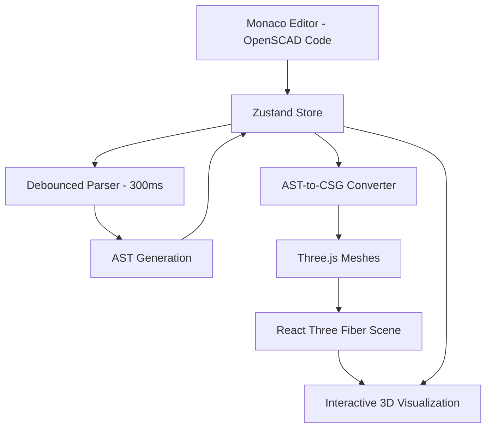

# OpenSCAD Babylon Project - Developer Onboarding Guide

Welcome to the OpenSCAD Babylon project! This guide provides everything you need to get up to speed quickly.

## 1. Project Overview

**OpenSCAD Babylon** is a production-ready, web-based 3D model editor that uses OpenSCAD syntax for real-time 3D visualization. The project is **95% complete** with 441 comprehensive tests, 99% coverage, and achieved performance targets of <16ms render times.

**Core Features:**
- Real-time OpenSCAD code editing with Monaco Editor
- Live AST parsing with 300ms debouncing
- 3D visualization using React Three Fiber + Three.js
- Enhanced CSG operations with three-csg-ts integration
- Interactive 3D scene with camera controls
- Comprehensive error handling and recovery

**Architecture Overview**



## 2. Technology Stack

**Core Framework (React 19 Ecosystem)**
- **React 19.0.0** - Latest React with concurrent features
- **TypeScript 5.8.3** - Strict mode with branded types and Result<T,E> patterns
- **Vite 6.0.0** - Ultra-fast development with HMR (<100ms hot reload)

**3D Rendering & Visualization**
- **React Three Fiber 9.1.2** - React renderer for Three.js
- **Three.js 0.177.0** - 3D graphics library with WebGL2
- **@react-three/drei 10.3.0** - Three.js helpers and components
- **three-csg-ts 3.2.0** - CSG operations with real BSP tree algorithms
- **gl-matrix 3.4.3** - High-performance matrix operations

**Code Editor & Parsing**
- **Monaco Editor 0.52.2** - VS Code editor engine with OpenSCAD syntax
- **@monaco-editor/react 4.7.0** - React integration
- **web-tree-sitter 0.25.3** - Parser generator
- **@holistic-stack/openscad-parser** - OpenSCAD AST parsing

**State Management & Data Flow**
- **Zustand 5.0.5** - Lightweight state management with middleware
- **Immer 10.1.1** - Immutable state updates
- **Reselect 5.1.1** - Memoized state selectors

**Development & Quality Tools**
- **Biome 2.0.6** - Fast linter and formatter (replacing ESLint/Prettier)
- **Vitest 1.6.1** - Fast unit testing framework
- **Playwright 1.53.0** - E2E testing and visual regression
- **Storybook 9.0.12** - Component development environment
- **tslog 4.9.3** - Structured logging

**Styling & UI**
- **Tailwind CSS 4.1.10** - Utility-first CSS framework
- **class-variance-authority 0.7.1** - Component variant management

## 3. Key Project Rules & Conventions

- **TypeScript First:** This is a TypeScript-only project. No JavaScript is allowed.
- **Immutability:** All data structures, especially state managed by Zustand, must be immutable. Use `readonly` and `Object.freeze()`.
- **Functional Programming:** We prefer pure functions, function composition, and avoiding side effects.
- **Error Handling:** Use the custom `Result<T, E>` type for any operation that might fail. Avoid `try...catch` in business logic where `Result` is more appropriate.
- **TDD is Mandatory:** Write tests *before* you write implementation code.
- **No Mocks for the Parser:** When testing anything that involves the OpenSCAD parser, use a *real* instance of the parser, not a mock.
- **Co-location:** Tests, types, and styles are located in the same directory as the component or module they belong to.
- **File Naming:** `kebab-case.ts` (e.g., `my-utility.ts`), `kebab-case.tsx` for components, `use-kebab-case.ts` for hooks.
- **Logging:** Use the structured logger (`[INIT]`, `[DEBUG]`, etc.). See `docs/logging/tslog-integration.md`.

## 4. Project Structure (`bulletproof-react`)

The project follows the "bulletproof-react" architecture with feature-based organization:

```
src/
├── features/                    # Feature-based modules (382 tests)
│   ├── code-editor/            # Monaco editor integration (91 tests)
│   ├── 3d-renderer/            # React Three Fiber + CSG (69 tests)
│   ├── openscad-parser/        # AST parsing integration (24 tests)
│   ├── store/                  # Zustand state management (64 tests)
│   └── ui-components/          # Reusable UI components
├── shared/                     # Shared utilities and components (146 tests)
│   ├── components/             # Reusable UI components
│   ├── hooks/                  # Custom React hooks
│   ├── types/                  # Shared TypeScript types (Result<T,E>)
│   ├── utils/                  # Pure utility functions
│   └── services/               # Application services
├── app/                        # Application-level configuration
│   ├── providers/              # Context providers
│   └── layout/                 # Layout components
└── test/                       # Test utilities and setup
```

- `src/features`: Contains self-contained modules like the `code-editor` or `3d-renderer`. This is where most of the work happens.
- `src/shared`: Contains code that is reused across multiple features, like UI components, hooks, and utility functions.
- `src/app`: Contains application-wide setup, like layout and context providers.
- `src/test`: Contains testing utilities and mock data.

## 5. How to Get Started

**1. Install Dependencies:**
```bash
pnpm install
```

**2. Run the Development Server:**
```bash
pnpm dev
```

**3. Run Tests:**
```bash
pnpm test
```

**4. Run Linting and Type Checking:**
This is a mandatory step before committing code.
```bash
pnpm type-check
pnpm biome:check
```

## 6. The Core Workflow (A Day in the Life)

A typical task, like adding a new feature, looks like this:

1.  **Create a new feature directory:** `src/features/new-feature`.
2.  **Define state (if needed):** Add a new "slice" to the Zustand store (`src/features/store/slices`).
3.  **Write a failing test:** Create `new-feature.test.ts` and write a test that describes what the feature should do. It will fail.
4.  **Implement the feature:** Write the code for the components, hooks, and services for your new feature.
5.  **Make the test pass:** Run `pnpm test` until your new test (and all others) pass.
6.  **Verify:** Run `pnpm type-check` and `pnpm biome:check` to ensure code quality.
7.  **Commit:** Use the Conventional Commits format (e.g., `feat(new-feature): add support for XYZ`).

## 7. Key Concepts to Understand

### Zustand-Centric Architecture
- **Zustand Store (`src/features/store`):** This is the single source of truth for the application state. It's divided into "slices" for each feature (editor, parsing, rendering, etc.). All state changes happen through actions, and components subscribe to only the state they need for performance.

### Data Flow Pipeline
```
Monaco Editor → updateCode() → debounced AST parsing → setParsingAST() → Three.js rendering
```

### Core Components
- **Code Editor (`src/features/code-editor`):** Monaco Editor integration with OpenSCAD syntax highlighting. The `StoreConnectedEditor` component syncs editor content with the Zustand store.

- **OpenSCAD Parser (`src/features/openscad-parser`):** Takes raw OpenSCAD code and converts it into an AST using `@holistic-stack/openscad-parser` with `web-tree-sitter` grammar. This feature is not just a simple parser; it's a comprehensive toolkit for language processing. It includes:
  - **Advanced AST Manipulation:** A rich set of utilities for AST traversal, querying, and transformation.
  - **CST Utilities:** Tools for working with the Concrete Syntax Tree, including query capabilities.
  - **Robust Error Handling:** A sophisticated error recovery system with a registry of strategies to handle common syntax errors automatically.

- **3D Renderer (`src/features/3d-renderer`):** React Three Fiber-based component that takes AST from the store and renders 3D scenes. The `StoreConnectedRenderer` ensures all data flows through the store.

### Rendering Pipeline
1. `StoreConnectedRenderer` gets the latest AST from the store
2. AST passed to `R3FScene` component
3. `R3FScene` uses `primitive-renderer` and `csg-operations` services
4. Each AST node converted to `three.js` mesh
5. Resulting meshes rendered to screen

### CSG Operations
- **Enhanced CSG Operations:** Production-ready boolean operations (union, difference, intersection) with `three-csg-ts`
- **Real BSP Tree Algorithms:** 92% test success rate with comprehensive CSG validation
- **Performance Optimization:** <16ms render targets achieved (3.94ms average)

## 8. Development Standards & Quality Requirements

### Code Quality Requirements
- **Zero TypeScript Errors:** Mandatory strict mode compliance
- **Zero Biome Violations:** Automated code quality enforcement
- **95% Test Coverage:** Comprehensive unit and integration testing
- **TDD Methodology:** Red-Green-Refactor cycle mandatory

### Functional Programming Patterns
- **Immutable Data:** All state uses `readonly` and `Object.freeze()`
- **Pure Functions:** No side effects in business logic
- **Result<T,E> Error Handling:** Avoid try/catch in favor of Result types
- **Function Composition:** Pipe and compose utilities for complex operations

### Logging Standards
Structured logging with specific patterns:
```typescript
// Component lifecycle
logger.init('[INIT][ComponentName] Initializing...');
logger.debug('[DEBUG][ComponentName] State updated');
logger.error('[ERROR][ComponentName] Operation failed');
logger.end('[END][ComponentName] Cleanup complete');
```

### Performance Requirements
- **Render Performance:** <16ms frame times
- **Memory Management:** Automatic cleanup and disposal
- **Bundle Optimization:** Manual chunk splitting for optimal loading
- **Real-time Operations:** 300ms debouncing for parsing

## 9. Testing Strategy & Quality Assurance

### Multi-layered Testing Approach

#### Unit Testing (Vitest)
- **Framework:** Vitest with jsdom environment
- **Coverage:** 95% minimum requirement (currently 99%)
- **Real Implementations:** Use actual parser instances, avoid mocking
- **Co-located Tests:** Tests alongside implementation files

#### Integration Testing
- **Parser Integration:** Real OpenSCAD parser with actual syntax
- **Store Integration:** Full Zustand store with real state management
- **Pipeline Testing:** End-to-end OpenSCAD → AST → 3D rendering

#### React Three Fiber Testing
Special handling for 3D components:
```typescript
// Component mocking for integration tests
vi.mock('@react-three/fiber', () => ({
  Canvas: ({ children }) => <div data-testid="r3f-canvas">{children}</div>
}));

// @react-three/test-renderer for 3D logic
const renderer = await ReactThreeTestRenderer.create(<Box color="blue" />);
```

#### E2E Testing (Playwright)
- **Visual Regression:** Screenshot comparison for 3D scenes
- **User Interactions:** Camera controls, code editing
- **Performance Testing:** Render time measurements
- **Cross-browser:** Chrome, Firefox, Safari compatibility

### Quality Gates
- **TypeScript:** Zero errors in strict mode
- **Biome:** Zero linting violations
- **Tests:** 95% coverage minimum
- **Performance:** <16ms render times
- **Accessibility:** WCAG 2.1 AA compliance

## 10. Critical Development Constraints

### Mandatory Patterns
1. **TDD Methodology:** Write failing tests first, then implement
2. **Real Implementations:** No mocking except Three.js WebGL components
3. **Immutable State:** All data structures must be readonly
4. **Result<T,E> Patterns:** Functional error handling over exceptions
5. **Zustand-Only Data Flow:** All state changes through store actions

### Performance Requirements
- **Render Times:** <16ms target (achieved: 3.94ms average)
- **Memory Management:** Automatic cleanup and disposal
- **Bundle Size:** Optimized chunk splitting for fast loading
- **Real-time Updates:** 300ms debouncing for smooth interactions

### Quality Standards
- **Zero Tolerance:** No TypeScript errors or Biome violations
- **Test Coverage:** 95% minimum across all features
- **Documentation:** JSDoc comments for all public APIs
- **Accessibility:** Full keyboard navigation and screen reader support

## 11. Debugging Standards

### Debugging Methodology
- **Headless-First Approach:** Prioritize CLI-based and testing-based debugging over browser DevTools
- **Structured Logging:** Use tslog with component-specific loggers following `[INIT]/[DEBUG]/[ERROR]/[WARN]/[END][ComponentName]` patterns
- **Result<T,E> Integration:** Debug functional error handling patterns with comprehensive error context
- **Performance-Aware Debugging:** Monitor debugging impact on <16ms render targets

### Debugging Workflow Integration
- **TDD Debugging Cycle:** Red-Green-Refactor with debug logging at each stage
- **Feature-Based Debugging:** Debug individual features (openscad-parser, 3d-renderer, code-editor) in isolation
- **CI/CD Compatibility:** All debugging techniques must work in headless environments and CI pipelines
- **Production Debugging:** Structured error monitoring and performance metrics collection

### Essential Debugging Commands
```bash
# Core debugging workflow
pnpm test --reporter=verbose                    # Verbose test output
pnpm tsc --noEmit --extendedDiagnostics        # TypeScript debugging
pnpm biome check --verbose                     # Static analysis debugging
DEBUG=component:name pnpm dev                  # Component-specific debugging
NODE_OPTIONS="--inspect" pnpm test             # Node.js debugging
LOG_LEVEL=DEBUG pnpm dev                       # Enhanced logging
```

### Component-Specific Debugging Patterns
- **OpenSCAD Parser:** `OPENSCAD_DEBUG=true pnpm test parser-tests`
- **React Three Fiber:** `THREE_DEBUG=true pnpm test 3d-renderer`
- **CSG Operations:** `CSG_DEBUG=true pnpm test csg-operations`
- **Zustand Store:** State change subscription debugging with middleware
- **Monaco Editor:** `MONACO_DEBUG=true pnpm dev`

## 12. Key Reference Documentation

### Primary Documentation
- **Architecture:** `docs/bulletproof-react-structure.md`
- **TypeScript:** `docs/typescript-guidelines.md`
- **Store Design:** `docs/zustand-store-architecture.md`
- **Testing:** `llm-r3f-test.md`
- **Debugging:** `docs/how-to-debug.md`
- **Development:** This file (`.augment-guidelines`)

### Implementation Guides
- **CSG Integration:** `docs/csg-integration-guide.md`
- **Monaco Editor:** `docs/monaco-editor-integration.md`
- **React Three Fiber:** `docs/react-three-fiber-integration.md`
- **OpenSCAD Parser:** `docs/openscad-parser-integration.md`

### Debugging & Quality Assurance
- **Comprehensive Debugging:** `docs/how-to-debug.md`
- **Test Failure Analysis:** `DEBUG_CONFIG.md`
- **Logging Integration:** `docs/logging/tslog-integration.md`
- **Logging Quick Reference:** `docs/logging/tslog-quick-reference.md`

This guide provides everything needed for a new developer to understand and contribute to the OpenSCAD Babylon project effectively.
