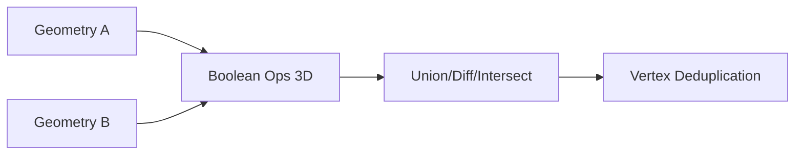

# 3D Operations (from src)

Breadcrumbs: Architecture > Geometry Builder > 3D Operations

Location
- src/features/openscad-geometry-builder/services/3d-operations/
- src/features/openscad-geometry-builder/services/primitive-generators/3d-primitives/vertex-operations/

Modules
- boolean-operations-3d: union, difference, intersection
- vertex-operations: vertex-deduplication (spatial hashing), helpers

Diagram


Usage
```ts
import { BooleanOperations3D } from '@/features/openscad-geometry-builder/services/3d-operations/boolean-operations-3d';
import { VertexDeduplication } from '@/features/openscad-geometry-builder/services/primitive-generators/3d-primitives/vertex-operations/vertex-deduplication';

const result = await BooleanOperations3D.union(geometryA, geometryB);
if (result.success) {
  const mesh = result.data; // with metadata (volume, surface area)
}

const deduped = VertexDeduplication.deduplicate(vertices, faces, { tolerance: 1e-6 });
```

Testing
- Unit tests for boolean ops and vertex operations.
- Performance tests for large meshes and overlap detection.

Best practices
- Deduplicate vertices before/after boolean ops for robust topology.
- Use bounding boxes for quick pre-checks before heavy operations.
- Keep tolerance small (e.g., 1e-6) to avoid collapsing distinct vertices.

See also
- architecture/geometry-builder.md
- architecture/polygon-operations.md
