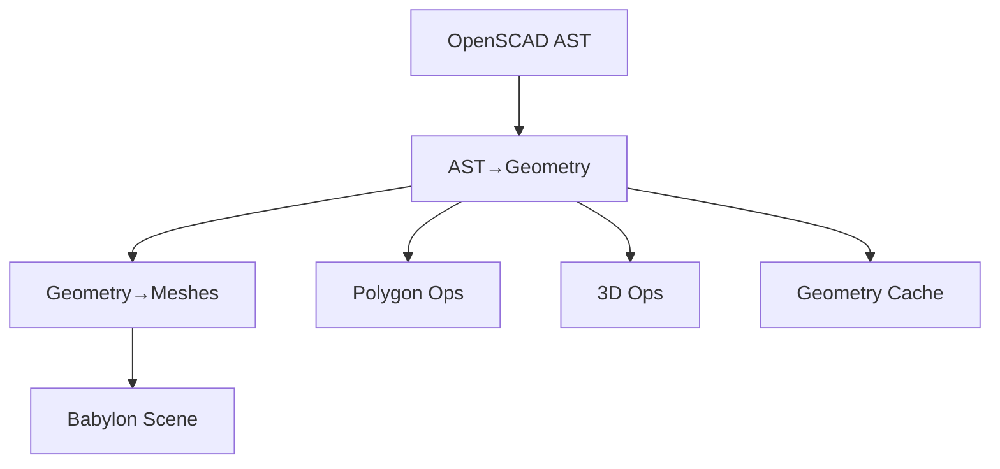

# OpenSCAD Geometry Builder (from src)

Breadcrumbs: Architecture > Geometry Builder

Scope
- Location: src/features/openscad-geometry-builder/
- Purpose: Convert OpenSCAD AST constructs into precise geometry data and Babylon meshes using OpenSCAD-compatible tessellation.

Core services
- ast-converter: AST→geometry
- geometry-to-mesh-converter: geometry→Babylon meshes
- geometry-cache: caching service
- fragment-calculator: tessellation helpers ($fn, $fs, $fa)
- geometry-bridge: Babylon mesh builder

Primitives
- 2d: circle, square, polygon (with factory)
- 3d: cube, cylinder, sphere, polyhedron (with factory)
- text: font-loader, text-generator
- imports: stl-importer, off-importer

Operations
- polygon operations: boolean-operations, offset-operations, polygon-validator
- 3d operations: boolean-operations-3d, vertex-operations

Pipeline
- services/pipeline: unified rendering pipeline with integration tests
- No fallbacks: operations must succeed via Geometry Builder or throw explicit errors

Test utilities
- result and geometry assertions, performance utilities, data generators

Diagram


Examples

Compute fragments (OpenSCAD rules)
```ts
import { calculateFragments } from '@/features/openscad-geometry-builder/services/fragment-calculator';

const fn = 0; // auto
const fs = 2; // min fragment size
const fa = 12; // min angle
const fragments = calculateFragments(5, fn, fa, fs);
```

Generate 3D primitives
```ts
import { Primitive3DFactory } from '@/features/openscad-geometry-builder/services/primitive-generators/3d-primitives/primitive-3d-factory';

const factory = new Primitive3DFactory();
const sphere = factory.sphere({ radius: 5, fn: 6 });
const cube = factory.cube({ size: [2, 4, 6], center: true });
const cylinder = factory.cylinder({ h: 10, r1: 3, r2: 5, fn: 8 });
```

Generate 2D primitives
```ts
import { Primitive2DFactory } from '@/features/openscad-geometry-builder/services/primitive-generators/2d-primitives/primitive-2d-factory';

const f2d = new Primitive2DFactory();
const circle = f2d.circle({ r: 5, fn: 6 });
const square = f2d.square({ size: [3, 7], center: false });
const polygon = f2d.polygon({ points: [[0,0],[10,0],[10,10],[0,10]], paths: [[0,1,2,3]] });
```

Import meshes
```ts
import { ImportService } from '@/features/openscad-geometry-builder/services/primitive-generators/import-primitives/import-service';

const importer = new ImportService();
// STL (binary or ASCII)
const stlResult = await importer.import({ fileName: 'model.stl', data: stlArrayBuffer });
// OFF (text)
const offResult = await importer.import({ fileName: 'model.off', data: offText });
```

Text outlines
```ts
import { TextGenerator } from '@/features/openscad-geometry-builder/services/primitive-generators/text-primitives/text-generator';

const text = new TextGenerator();
const outlines = await text.generate({ text: 'Hello', size: 12, font: 'Arial', halign: 'center', valign: 'baseline' });
```

Mesh conversion
```ts
import { BabylonMeshBuilder } from '@/features/openscad-geometry-builder/services/geometry-bridge/babylon-mesh-builder';

const builder = new BabylonMeshBuilder(scene);
const mesh = builder.createPolyhedronMesh(sphere.data);
```

Best practices
- Always compute fragments via fragment-calculator; do not hardcode.
- Use factories for primitives to keep code consistent and typed.
- Cache geometry (geometry-cache) for repeated shapes.
- Validate polygons with polygon-validator before operations.
- Prefer readonly arrays and immutable data structures.

See also
- architecture/polygon-operations.md
- architecture/3d-operations.md
- architecture/babylon-renderer.md
- architecture/workflow.md
