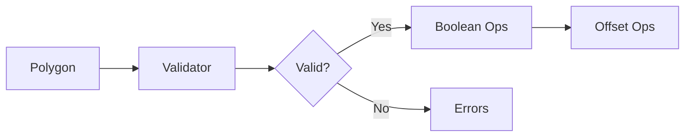

# Polygon Operations (from src)

Breadcrumbs: Architecture > Geometry Builder > Polygon Operations

Location
- src/features/openscad-geometry-builder/services/polygon-operations/

Modules
- boolean-operations: 2D polygon boolean operations
- offset-operations: 2D offset with fragments for arcs
- polygon-validator: structural validation and self-intersection checks

Diagram


Usage
```ts
import { PolygonBooleanOps } from '@/features/openscad-geometry-builder/services/polygon-operations/boolean-operations';
import { OffsetOperations } from '@/features/openscad-geometry-builder/services/polygon-operations/offset-operations';
import { PolygonValidator } from '@/features/openscad-geometry-builder/services/polygon-operations/polygon-validator';

const isValid = PolygonValidator.isValid(polygon);
const union = PolygonBooleanOps.union([polyA, polyB]);
const expanded = OffsetOperations.expand(polygon, { radius: 2, fragments: 16 });
```

Testing
- Tests validate edge cases: touching vs overlapping shapes, self-intersections, holes.

Best practices
- Validate polygons before operations to avoid undefined geometry.
- Use project fragment rules for arc approximations in offsets.

See also
- architecture/geometry-builder.md
- architecture/3d-operations.md
