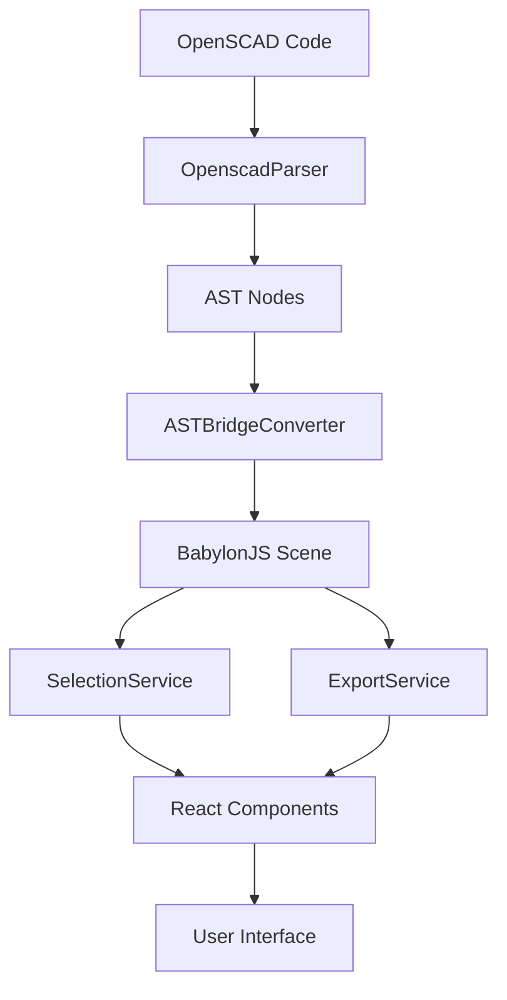

# OpenSCAD Babylon API Documentation

## Overview

The OpenSCAD Babylon project provides a comprehensive TypeScript/React library for parsing OpenSCAD code and rendering it as interactive 3D models using BabylonJS. This API documentation covers all public interfaces, components, and utilities.

## Quick Start

```typescript
import { OpenscadParser, ASTBridgeConverter, useSelection, BabylonCanvas } from 'openscad-babylon';

// Basic usage
const parser = new OpenscadParser();
await parser.init();

const result = parser.parseASTWithResult('cube([2, 2, 2]);');
if (result.success) {
  console.log('Parsed successfully:', result.data);
}
```

## API Reference

### Core APIs

#### [OpenSCAD Parser API](./openscad-parser-api.md)
- **`OpenscadParser`** - Main parser class for OpenSCAD code
- **AST Node Types** - Type definitions for parsed syntax trees
- **Error Handling** - Comprehensive error types and recovery
- **Performance** - Parsing optimization and memory management

**Key Features:**
- Tree-sitter based parsing with error recovery
- Comprehensive AST node types for all OpenSCAD constructs
- Result-based error handling with detailed error information
- Support for primitives, transformations, and boolean operations

#### [BabylonJS Renderer API](./babylon-renderer-api.md)
- **`ASTBridgeConverter`** - Converts AST to BabylonJS representations
- **`SelectionService`** - 3D object selection and highlighting
- **`ExportService`** - Multi-format 3D model export
- **CSG Operations** - Boolean operations with Manifold integration

**Key Features:**
- Real-time AST to 3D mesh conversion
- Interactive object selection with visual feedback
- Export to STL, 3MF, GLTF, and GLB formats
- Advanced CSG operations for complex geometries

#### [React Components API](./react-components-api.md)
- **`BabylonCanvas`** - Main 3D rendering component
- **`SelectionInfo`** - Object information display
- **`ExportDialog`** - Export configuration interface
- **React Hooks** - State management and operations

**Key Features:**
- Declarative React components for 3D rendering
- Comprehensive hooks for selection, export, and progress
- TypeScript-first with full type safety
- Accessibility and keyboard navigation support

## Architecture Overview



## Common Usage Patterns

### 1. Basic Parsing and Rendering

```typescript
import { OpenscadParser, ASTBridgeConverter } from 'openscad-babylon';

async function renderOpenSCAD(code: string, scene: Scene) {
  // Parse OpenSCAD code
  const parser = new OpenscadParser();
  await parser.init();
  
  const parseResult = parser.parseASTWithResult(code);
  if (!parseResult.success) {
    throw new Error(`Parse failed: ${parseResult.error.message}`);
  }
  
  // Convert to 3D
  const converter = new ASTBridgeConverter(scene);
  await converter.initialize();
  
  const convertResult = await converter.convertAST(parseResult.data);
  if (!convertResult.success) {
    throw new Error(`Conversion failed: ${convertResult.error.message}`);
  }
  
  // Cleanup
  parser.dispose();
  converter.dispose();
  
  return convertResult.data;
}
```

### 2. React Component Integration

```typescript
import { BabylonCanvas, SelectionInfo, ExportDialog } from 'openscad-babylon';

function CADViewer() {
  const [code, setCode] = useState('cube([2, 2, 2]);');
  const [scene, setScene] = useState<Scene | null>(null);

  return (
    <div className="cad-viewer">
      <BabylonCanvas
        openscadCode={code}
        onSceneReady={setScene}
        enableSelection={true}
      />
      
      <SelectionInfo
        scene={scene}
        showMetadata={true}
        showBoundingBox={true}
      />
    </div>
  );
}
```

### 3. Selection and Export Workflow

```typescript
import { useSelection, useExport } from 'openscad-babylon';

function CADControls({ scene }: { scene: Scene }) {
  const { selectedMeshes, clearSelection } = useSelection(scene);
  const { exportMeshes, isExporting } = useExport(scene);

  const handleExport = async () => {
    const config = {
      format: 'stl' as const,
      filename: 'model.stl',
      binary: true
    };
    
    await exportMeshes(selectedMeshes, config);
  };

  return (
    <div>
      <p>{selectedMeshes.length} objects selected</p>
      <button onClick={clearSelection}>Clear</button>
      <button onClick={handleExport} disabled={isExporting}>
        Export STL
      </button>
    </div>
  );
}
```

## Type Definitions

### Core Types

```typescript
// Result type for error handling
type Result<T, E> = 
  | { success: true; data: T }
  | { success: false; error: E };

// AST node base interface
interface ASTNode {
  readonly type: string;
  readonly startPosition: Position;
  readonly endPosition: Position;
  readonly children?: readonly ASTNode[];
}

// Export configuration
interface ExportConfig {
  readonly format: 'stl' | '3mf' | 'gltf' | 'glb';
  readonly filename: string;
  readonly quality?: 'low' | 'medium' | 'high' | 'ultra';
  readonly binary?: boolean;
}
```

### React Hook Returns

```typescript
// Selection hook return type
interface UseSelectionReturn {
  readonly selectedMeshes: readonly AbstractMesh[];
  readonly clearSelection: () => void;
  readonly selectMesh: (mesh: AbstractMesh) => void;
  readonly isMultiSelection: boolean;
}

// Export hook return type
interface UseExportReturn {
  readonly exportMeshes: (meshes: AbstractMesh[], config: ExportConfig) => Promise<Result<ExportResult, ExportError>>;
  readonly isExporting: boolean;
  readonly exportProgress: number;
  readonly getSupportedFormats: () => readonly ExportFormat[];
}
```

## Error Handling

All APIs use Result types for comprehensive error handling:

```typescript
const result = await someOperation();

if (result.success) {
  // Handle success
  const data = result.data;
  console.log('Operation succeeded:', data);
} else {
  // Handle error
  const error = result.error;
  console.error(`${error.code}: ${error.message}`);
  
  // Error-specific handling
  switch (error.code) {
    case 'PARSE_FAILED':
      // Handle parse errors
      break;
    case 'CONVERSION_FAILED':
      // Handle conversion errors
      break;
    case 'EXPORT_FAILED':
      // Handle export errors
      break;
  }
}
```

## Performance Guidelines

### Parser Performance
- Initialize parser once and reuse for multiple operations
- Use debouncing for real-time code editing (300ms recommended)
- Dispose of parser when no longer needed to prevent memory leaks

### Rendering Performance
- Limit scene complexity for real-time interaction
- Use LOD (Level of Detail) for complex models
- Dispose of unused meshes and materials

### React Performance
- Use `React.memo` for expensive components
- Implement proper dependency arrays in hooks
- Avoid creating new objects in render methods

## Browser Compatibility

- **Modern Browsers**: Chrome 90+, Firefox 88+, Safari 14+, Edge 90+
- **WebGL**: WebGL 2.0 required for advanced features
- **WebAssembly**: Required for Manifold CSG operations
- **ES Modules**: Native ES module support required

## Migration Guide

### From Previous Versions

1. **Parser API Changes**:
   ```typescript
   // Old
   const ast = parser.parse(code);
   
   // New
   const result = parser.parseASTWithResult(code);
   if (result.success) {
     const ast = result.data;
   }
   ```

2. **Error Handling**:
   ```typescript
   // Old
   try {
     const result = await operation();
   } catch (error) {
     console.error(error);
   }
   
   // New
   const result = await operation();
   if (!result.success) {
     console.error(result.error.message);
   }
   ```

3. **Component Props**:
   ```typescript
   // Old
   <BabylonCanvas code={openscadCode} />
   
   // New
   <BabylonCanvas openscadCode={openscadCode} />
   ```

## Support and Resources

- **GitHub Repository**: [openscad-babylon](https://github.com/your-org/openscad-babylon)
- **Issue Tracker**: Report bugs and feature requests
- **Discussions**: Community support and questions
- **Examples**: See `/examples` directory for complete applications

## Contributing

See [CONTRIBUTING.md](../CONTRIBUTING.md) for guidelines on:
- Code style and standards
- Testing requirements
- Documentation standards
- Pull request process

## License

This project is licensed under the MIT License. See [LICENSE](../LICENSE) for details.
