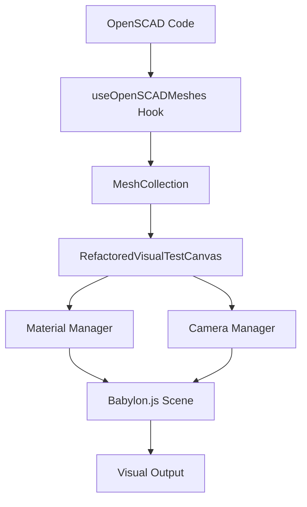

# Visual Testing Guide - Fully Refactored Components

This guide provides comprehensive instructions for using **Option 3: Fully Refactored Components** in your visual regression tests. This approach gives you maximum control and flexibility over the rendering pipeline.

## Table of Contents

1. [Overview](#overview)
2. [Architecture](#architecture)
3. [Basic Setup](#basic-setup)
4. [Component Reference](#component-reference)
5. [Advanced Configuration](#advanced-configuration)
6. [Testing Patterns](#testing-patterns)
7. [Error Handling](#error-handling)
8. [Performance Optimization](#performance-optimization)
9. [Troubleshooting](#troubleshooting)

## Overview

The fully refactored approach separates concerns into distinct, composable components:

- **`useOpenSCADMeshes`** - Hook for converting OpenSCAD code to Babylon.js meshes
- **`RefactoredVisualTestCanvas`** - Core rendering component that accepts meshes as props
- **Material Manager** - Pure functions for material creation and application
- **Camera Manager** - Pure functions for camera positioning

### Benefits

✅ **Maximum Control** - Configure every aspect of the rendering pipeline  
✅ **Better Performance** - Optimized resource management and caching  
✅ **Enhanced Testability** - Pure functions and clear separation of concerns  
✅ **Type Safety** - Comprehensive TypeScript interfaces  
✅ **Reusability** - Components can be composed in different ways  

## Architecture



## Basic Setup

### 1. Import Required Components

```tsx
import { 
  RefactoredVisualTestCanvas, 
  useOpenSCADMeshes,
  type MeshCollection,
  type VisualTestSceneConfig 
} from '../path/to/visual-test-canvas';
import { useBabylonEngine } from '../path/to/use-babylon-engine';
import { useBabylonScene } from '../path/to/use-babylon-scene';
```

### 2. Basic Test Component Structure

```tsx
function MyVisualTest() {
  // 1. Initialize Babylon.js engine and scene
  const { engine, isReady: engineReady } = useBabylonEngine({
    antialias: true,
    preserveDrawingBuffer: true
  });
  
  const { scene, isReady: sceneReady } = useBabylonScene({
    engine,
    enableCamera: true,
    enableLighting: true
  });

  // 2. Generate meshes from OpenSCAD code
  const { meshes, isLoading, error } = useOpenSCADMeshes({
    scene,
    openscadCode: "translate([10, 0, 0]) cube([5, 5, 5]);",
    referenceOpenscadCode: "cube([5, 5, 5]);",
    enableDebugLogging: true
  });

  // 3. Handle loading and error states
  if (!engineReady || !sceneReady) return <div>Initializing Babylon.js...</div>;
  if (isLoading) return <div>Generating meshes...</div>;
  if (error) return <div>Error: {error}</div>;

  // 4. Render the visual test canvas
  return (
    <RefactoredVisualTestCanvas
      testName="my-test"
      meshes={meshes}
      visualSceneConfig={{
        backgroundColor: '#000000',
        camera: { autoPosition: true }
      }}
      width={800}
      height={600}
      enableDebugLogging={true}
    />
  );
}
```

### 3. Playwright Test Integration

```tsx
import { test, expect } from '@playwright/experimental-ct-react';

test('should render custom visual test', async ({ mount, page }) => {
  console.log('[INIT] Testing custom visual rendering');
  
  const component = await mount(<MyVisualTest />);
  
  // Wait for rendering to complete
  await page.waitForTimeout(4500);
  
  // Take screenshot for visual regression
  await expect(component).toHaveScreenshot('my-test.png');
  
  console.log('[END] Custom visual test completed');
});
```

## Component Reference

### useOpenSCADMeshes Hook

Converts OpenSCAD code to Babylon.js meshes with comprehensive error handling.

```tsx
const {
  meshes,           // MeshCollection - Generated meshes
  isLoading,        // boolean - Loading state
  error,            // string | null - Error message
  regenerate        // () => void - Regenerate meshes
} = useOpenSCADMeshes({
  scene: babylonScene,                    // Required: Babylon.js scene
  openscadCode: "cube([5, 5, 5]);",      // Required: Main OpenSCAD code
  referenceOpenscadCode?: "cube([5,5,5]);", // Optional: Reference mesh code
  enableDebugLogging?: true,              // Optional: Enable logging
  meshConfig?: {                          // Optional: Mesh configuration
    enableOptimization: true,
    generateNormals: true,
    generateUVs: false
  }
});
```

#### MeshCollection Type

```tsx
interface MeshCollection {
  readonly mainMeshes: readonly BABYLON.Mesh[];      // Primary meshes
  readonly referenceMeshes: readonly BABYLON.Mesh[]; // Reference/ghost meshes
  readonly totalCount: number;                       // Total mesh count
  readonly hasMainMeshes: boolean;                   // Has main meshes
  readonly hasReferenceMeshes: boolean;              // Has reference meshes
}
```

### RefactoredVisualTestCanvas Component

Core rendering component that accepts pre-generated meshes.

```tsx
<RefactoredVisualTestCanvas
  // Required Props
  meshes={meshCollection}                    // MeshCollection from hook
  
  // Optional Props
  testName="my-test"                         // Test identifier
  visualSceneConfig={sceneConfig}            // Scene configuration
  width={800}                                // Canvas width
  height={600}                               // Canvas height
  enableDebugLogging={true}                  // Enable logging
  
  // Callback Props
  onMeshesReady={(meshes) => {}}            // Called when meshes are processed
  onRenderingComplete={() => {}}             // Called when rendering is complete
  onRenderFrame={(scene) => {}}             // Called each render frame
  
  // Babylon.js Props (passed through)
  sceneConfig={babylonSceneConfig}           // Babylon scene config
  engineConfig={babylonEngineConfig}        // Babylon engine config
/>
```

## Advanced Configuration

### Scene Configuration

```tsx
const visualSceneConfig: VisualTestSceneConfig = {
  // Background
  backgroundColor: '#000000',              // Hex color string
  
  // Camera Settings
  camera: {
    autoPosition: true,                    // Auto-position for meshes
    paddingFactor: 4.0,                   // Zoom out factor
    minDistance: 10,                      // Minimum camera distance
    maxDistance: 100,                     // Maximum camera distance
    preferredAngle: [Math.PI/3, Math.PI/4] // [alpha, beta] angles
  },
  
  // Lighting Settings
  lighting: {
    enableDefaultLighting: true,          // Enable default lights
    ambientIntensity: 0.8,               // Ambient light intensity
    directionalIntensity: 0.6,           // Directional light intensity
    pointIntensity: 0.4                  // Point light intensity
  },
  
  // Material Settings
  materialTheme: 'high-contrast',         // 'default' | 'high-contrast' | 'colorful' | 'monochrome'
  
  // Advanced Settings
  enableFog: false,                       // Enable scene fog
  enableShadows: false,                   // Enable shadow rendering
  enablePostProcessing: false             // Enable post-processing effects
};
```

### Material Themes

```tsx
// Available material themes
type MaterialTheme = 'default' | 'high-contrast' | 'colorful' | 'monochrome';

// Theme characteristics:
// - 'default': White main meshes, transparent reference meshes
// - 'high-contrast': Bright colors with high contrast
// - 'colorful': Vibrant colors for different mesh types
// - 'monochrome': Grayscale with different intensities
```

### Custom Material Configuration

```tsx
import { applyMaterialsToMeshCollection, getMaterialTheme } from './visual-test-canvas';

// Apply custom materials
const materialResult = await applyMaterialsToMeshCollection(
  meshCollection,
  scene,
  {
    theme: 'colorful',
    mainMeshConfig: {
      diffuseColor: '#ff6b6b',
      specularColor: '#ffffff',
      emissiveColor: '#000000',
      alpha: 1.0
    },
    referenceMeshConfig: {
      diffuseColor: '#4ecdc4',
      alpha: 0.3,
      wireframe: true
    }
  }
);
```

### Custom Camera Positioning

```tsx
import { positionCameraForMeshes, calculateMeshBounds } from './visual-test-canvas';

// Manual camera positioning
const cameraResult = await positionCameraForMeshes(
  meshCollection,
  scene,
  {
    autoPosition: false,
    paddingFactor: 6.0,
    preferredAngle: [Math.PI/2, Math.PI/3],
    minDistance: 15,
    maxDistance: 50
  }
);

// Calculate bounds for custom positioning
const boundsResult = calculateMeshBounds(meshCollection.mainMeshes);
if (boundsResult.success) {
  const { min, max, center, size } = boundsResult.data;
  // Use bounds for custom camera logic
}
```

## Testing Patterns

### Pattern 1: Simple Transformation Test

```tsx
function TransformationTest({ transformation }: { transformation: string }) {
  const { engine, isReady: engineReady } = useBabylonEngine();
  const { scene, isReady: sceneReady } = useBabylonScene({ engine });
  
  const { meshes, isLoading, error } = useOpenSCADMeshes({
    scene,
    openscadCode: `${transformation} cube([5, 5, 5]);`,
    referenceOpenscadCode: "cube([5, 5, 5]);",
    enableDebugLogging: true
  });

  if (!engineReady || !sceneReady || isLoading) return <div>Loading...</div>;
  if (error) return <div>Error: {error}</div>;

  return (
    <RefactoredVisualTestCanvas
      testName={`transformation-${transformation.replace(/[^a-z0-9]/gi, '-')}`}
      meshes={meshes}
      visualSceneConfig={{
        backgroundColor: '#000000',
        camera: { autoPosition: true, paddingFactor: 5.0 },
        materialTheme: 'high-contrast'
      }}
      width={800}
      height={600}
    />
  );
}

// Usage in Playwright test
test('translate transformation', async ({ mount }) => {
  const component = await mount(
    <TransformationTest transformation="translate([10, 0, 0])" />
  );
  await expect(component).toHaveScreenshot('translate-x.png');
});
```

### Pattern 2: Complex Scene Test

```tsx
function ComplexSceneTest() {
  const { engine, isReady: engineReady } = useBabylonEngine({
    antialias: true,
    preserveDrawingBuffer: true,
    stencil: true
  });
  
  const { scene, isReady: sceneReady } = useBabylonScene({
    engine,
    enableCamera: true,
    enableLighting: true,
    backgroundColor: '#1a1a1a'
  });

  const { meshes, isLoading, error } = useOpenSCADMeshes({
    scene,
    openscadCode: `
      union() {
        translate([0, 0, 0]) cube([10, 10, 10]);
        translate([5, 5, 5]) sphere(r=8);
        translate([15, 0, 0]) cylinder(h=20, r=3);
      }
    `,
    enableDebugLogging: true,
    meshConfig: {
      enableOptimization: true,
      generateNormals: true
    }
  });

  if (!engineReady || !sceneReady || isLoading) return <div>Loading...</div>;
  if (error) return <div>Error: {error}</div>;

  return (
    <RefactoredVisualTestCanvas
      testName="complex-scene"
      meshes={meshes}
      visualSceneConfig={{
        backgroundColor: '#1a1a1a',
        camera: {
          autoPosition: true,
          paddingFactor: 3.0,
          preferredAngle: [Math.PI/4, Math.PI/6]
        },
        lighting: {
          enableDefaultLighting: true,
          ambientIntensity: 0.6,
          directionalIntensity: 0.8
        },
        materialTheme: 'colorful',
        enableShadows: true
      }}
      width={1200}
      height={800}
      onRenderingComplete={() => console.log('Complex scene rendered')}
    />
  );
}
```

### Pattern 3: Performance Test with Multiple Meshes

```tsx
function PerformanceTest() {
  const [meshCount, setMeshCount] = useState(10);
  const { engine, isReady: engineReady } = useBabylonEngine();
  const { scene, isReady: sceneReady } = useBabylonScene({ engine });

  // Generate OpenSCAD code for multiple objects
  const openscadCode = useMemo(() => {
    const objects = Array.from({ length: meshCount }, (_, i) => 
      `translate([${i * 3}, 0, 0]) cube([2, 2, 2]);`
    ).join('\n');
    return `union() {\n${objects}\n}`;
  }, [meshCount]);

  const { meshes, isLoading, error } = useOpenSCADMeshes({
    scene,
    openscadCode,
    enableDebugLogging: true,
    meshConfig: {
      enableOptimization: true
    }
  });

  if (!engineReady || !sceneReady || isLoading) return <div>Loading...</div>;
  if (error) return <div>Error: {error}</div>;

  return (
    <div>
      <div>
        <label>
          Mesh Count: 
          <input 
            type="range" 
            min="1" 
            max="50" 
            value={meshCount}
            onChange={(e) => setMeshCount(Number(e.target.value))}
          />
          {meshCount}
        </label>
      </div>
      <RefactoredVisualTestCanvas
        testName={`performance-${meshCount}-meshes`}
        meshes={meshes}
        visualSceneConfig={{
          backgroundColor: '#000000',
          camera: { autoPosition: true, paddingFactor: 2.0 },
          materialTheme: 'default'
        }}
        width={800}
        height={600}
        onRenderingComplete={() => 
          console.log(`Rendered ${meshes.totalCount} meshes`)
        }
      />
    </div>
  );
}
```

## Error Handling

### Comprehensive Error Handling Pattern

```tsx
function RobustVisualTest({ openscadCode }: { openscadCode: string }) {
  const [retryCount, setRetryCount] = useState(0);
  const { engine, isReady: engineReady, error: engineError } = useBabylonEngine();
  const { scene, isReady: sceneReady, error: sceneError } = useBabylonScene({ engine });

  const { meshes, isLoading, error: meshError, regenerate } = useOpenSCADMeshes({
    scene,
    openscadCode,
    enableDebugLogging: true
  });

  // Handle errors with retry logic
  const handleRetry = useCallback(() => {
    if (retryCount < 3) {
      setRetryCount(prev => prev + 1);
      regenerate();
    }
  }, [retryCount, regenerate]);

  // Render error states
  if (engineError) {
    return (
      <div className="error-container">
        <h3>Engine Error</h3>
        <p>{engineError}</p>
        <button onClick={() => window.location.reload()}>Reload Page</button>
      </div>
    );
  }

  if (sceneError) {
    return (
      <div className="error-container">
        <h3>Scene Error</h3>
        <p>{sceneError}</p>
        <button onClick={() => window.location.reload()}>Reload Page</button>
      </div>
    );
  }

  if (meshError) {
    return (
      <div className="error-container">
        <h3>Mesh Generation Error</h3>
        <p>{meshError}</p>
        <p>Retry attempt: {retryCount}/3</p>
        {retryCount < 3 && (
          <button onClick={handleRetry}>Retry</button>
        )}
        <details>
          <summary>OpenSCAD Code</summary>
          <pre>{openscadCode}</pre>
        </details>
      </div>
    );
  }

  // Render loading states
  if (!engineReady || !sceneReady) {
    return <div>Initializing Babylon.js...</div>;
  }

  if (isLoading) {
    return <div>Generating meshes... (attempt {retryCount + 1})</div>;
  }

  // Render success state
  return (
    <RefactoredVisualTestCanvas
      testName="robust-test"
      meshes={meshes}
      visualSceneConfig={{
        backgroundColor: '#000000',
        camera: { autoPosition: true }
      }}
      width={800}
      height={600}
      enableDebugLogging={true}
      onRenderingComplete={() => console.log('Rendering completed successfully')}
    />
  );
}
```

## Performance Optimization

### Optimization Strategies

```tsx
// 1. Memoize expensive computations
const memoizedSceneConfig = useMemo((): VisualTestSceneConfig => ({
  backgroundColor: '#000000',
  camera: { autoPosition: true, paddingFactor: 4.0 },
  materialTheme: 'high-contrast'
}), []);

// 2. Optimize mesh generation
const { meshes } = useOpenSCADMeshes({
  scene,
  openscadCode,
  meshConfig: {
    enableOptimization: true,    // Enable mesh optimization
    generateNormals: true,       // Generate normals for lighting
    generateUVs: false,          // Skip UV generation if not needed
    mergeVertices: true,         // Merge duplicate vertices
    simplifyMesh: true           // Simplify complex meshes
  }
});

// 3. Use callback refs for performance-critical operations
const handleRenderingComplete = useCallback(() => {
  // Performance-critical code here
  console.log('Rendering complete');
}, []);

// 4. Debounce prop changes
const debouncedOpenSCADCode = useDebounce(openscadCode, 300);
```

### Memory Management

```tsx
function MemoryEfficientTest() {
  const [isVisible, setIsVisible] = useState(true);
  
  // Cleanup resources when component is not visible
  useEffect(() => {
    if (!isVisible) {
      // Trigger cleanup
      return () => {
        // Additional cleanup if needed
      };
    }
  }, [isVisible]);

  if (!isVisible) {
    return <div>Test hidden to save memory</div>;
  }

  return (
    <RefactoredVisualTestCanvas
      // ... props
      onRenderingComplete={() => {
        // Consider hiding component after screenshot
        setTimeout(() => setIsVisible(false), 1000);
      }}
    />
  );
}
```

## Troubleshooting

### Common Issues and Solutions

#### Issue: Meshes not appearing
```tsx
// Check mesh generation
const { meshes, error } = useOpenSCADMeshes({
  scene,
  openscadCode,
  enableDebugLogging: true  // Enable this to see detailed logs
});

// Verify mesh collection
console.log('Mesh collection:', {
  totalCount: meshes.totalCount,
  hasMainMeshes: meshes.hasMainMeshes,
  hasReferenceMeshes: meshes.hasReferenceMeshes
});
```

#### Issue: Camera positioning problems
```tsx
// Use manual camera positioning
const visualSceneConfig = {
  camera: {
    autoPosition: false,  // Disable auto-positioning
    paddingFactor: 6.0,   // Increase padding
    minDistance: 20,      // Set minimum distance
    preferredAngle: [Math.PI/2, Math.PI/3]  // Set specific angle
  }
};
```

#### Issue: Material application failures
```tsx
// Check material application results
<RefactoredVisualTestCanvas
  meshes={meshes}
  onMeshesReady={(processedMeshes) => {
    console.log('Materials applied to:', processedMeshes.totalCount, 'meshes');
  }}
  enableDebugLogging={true}
/>
```

#### Issue: Performance problems
```tsx
// Optimize mesh generation
const { meshes } = useOpenSCADMeshes({
  scene,
  openscadCode,
  meshConfig: {
    enableOptimization: true,
    simplifyMesh: true,
    mergeVertices: true
  }
});

// Reduce visual quality for performance
const visualSceneConfig = {
  enableShadows: false,
  enablePostProcessing: false,
  lighting: {
    enableDefaultLighting: true,
    ambientIntensity: 1.0,  // Higher ambient, lower other lights
    directionalIntensity: 0.2,
    pointIntensity: 0.0
  }
};
```

### Debug Logging Analysis

Enable debug logging and look for these patterns:

```
✅ Good patterns:
[REFACTORED-VISUAL-TEST:test-name] [DEBUG] Materials applied: 2 successful, 0 failed
[REFACTORED-VISUAL-TEST:test-name] [DEBUG] Camera positioned successfully at distance 17.5
[REFACTORED-VISUAL-TEST:test-name] [END] Rendering complete

❌ Problem patterns:
[REFACTORED-VISUAL-TEST:test-name] [WARN] Material error: ...
[REFACTORED-VISUAL-TEST:test-name] [WARN] Camera positioning failed: ...
[REFACTORED-VISUAL-TEST:test-name] [ERROR] Mesh processing failed: ...
```

### Testing Checklist

Before deploying your visual tests:

- [ ] ✅ Debug logging enabled during development
- [ ] ✅ Error handling implemented for all failure modes
- [ ] ✅ Performance tested with expected mesh counts
- [ ] ✅ Visual regression baselines updated
- [ ] ✅ Memory usage verified (no leaks)
- [ ] ✅ Cross-browser compatibility tested
- [ ] ✅ Documentation updated with any custom patterns

## Next Steps

1. **Start Simple** - Begin with basic transformation tests
2. **Add Complexity Gradually** - Introduce advanced features as needed
3. **Monitor Performance** - Use browser dev tools to track resource usage
4. **Create Reusable Patterns** - Extract common configurations into utilities
5. **Document Custom Patterns** - Share successful patterns with your team

The fully refactored components provide maximum flexibility and control while maintaining excellent performance and type safety. Use this guide as a reference for implementing sophisticated visual regression tests that meet your specific requirements.
