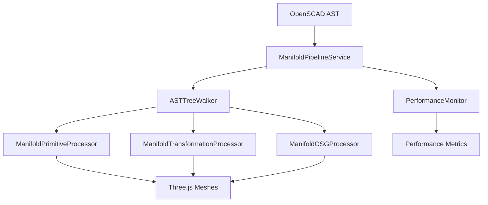

# Manifold Pipeline API Documentation

## Overview

The Manifold Pipeline is a production-ready, high-performance 3D geometry processing system that converts OpenSCAD Abstract Syntax Trees (AST) into Three.js-compatible meshes using the Manifold WASM library for advanced CSG operations.

## Architecture



## Core Components

### ManifoldPipelineService

The main orchestration service that coordinates all pipeline operations.

#### Constructor

```typescript
constructor(dependencies: {
  primitiveProcessor: ManifoldPrimitiveProcessor;
  transformationProcessor: ManifoldTransformationProcessor;
  csgProcessor: ManifoldCSGProcessor;
})
```

#### Methods

##### `initialize(): Promise<Result<void, string>>`

Initializes the pipeline and all processors.

**Returns:** Result indicating success or failure with error message.

**Example:**
```typescript
const pipelineService = new ManifoldPipelineService({
  primitiveProcessor: new ManifoldPrimitiveProcessor(),
  transformationProcessor: new ManifoldTransformationProcessor(),
  csgProcessor: new ManifoldCSGProcessor()
});

const initResult = await pipelineService.initialize();
if (!initResult.success) {
  console.error('Pipeline initialization failed:', initResult.error);
}
```

##### `processNodes(nodes: ASTNode[]): Promise<Result<ManifoldPipelineResult, string>>`

Processes an array of AST nodes and returns the resulting geometries.

**Parameters:**
- `nodes`: Array of OpenSCAD AST nodes to process

**Returns:** Result containing pipeline result with geometries and metadata.

**Example:**
```typescript
const parseResult = openscadParser.parseASTWithResult('cube([2, 3, 4]);');
if (parseResult.success) {
  const result = await pipelineService.processNodes(parseResult.data);
  if (result.success) {
    console.log(`Generated ${result.data.geometries.length} geometries`);
    console.log(`Processing time: ${result.data.processingTime}ms`);
    console.log(`Operations: ${result.data.operationsPerformed.join(', ')}`);
  }
}
```

##### `dispose(): void`

Cleans up resources and disposes of all processors.

### ASTTreeWalker

Traverses AST nodes and coordinates processing with appropriate processors.

#### Methods

##### `walkNodes(nodes: ASTNode[]): Promise<Result<ProcessedGeometry[], string>>`

Recursively walks through AST nodes and processes them.

**Parameters:**
- `nodes`: Array of AST nodes to walk

**Returns:** Result containing array of processed geometries.

**Example:**
```typescript
const treeWalker = new ASTTreeWalker(processors);
const result = await treeWalker.walkNodes(astNodes);
if (result.success) {
  result.data.forEach(geometry => {
    console.log(`Geometry: ${geometry.type}, Vertices: ${geometry.vertices.length}`);
  });
}
```

### ManifoldPrimitiveProcessor

Processes primitive shapes (cube, sphere, cylinder) using Manifold WASM.

#### Supported Primitives

##### Cube
```typescript
// OpenSCAD: cube([2, 3, 4]);
interface CubeNode {
  type: 'cube';
  size?: [number, number, number];
  center?: boolean;
}
```

##### Sphere
```typescript
// OpenSCAD: sphere(r=1.5);
interface SphereNode {
  type: 'sphere';
  radius?: number;
  diameter?: number;
}
```

##### Cylinder
```typescript
// OpenSCAD: cylinder(h=5, r=2);
interface CylinderNode {
  type: 'cylinder';
  height?: number;
  radius?: number;
  diameter?: number;
  radius1?: number;
  radius2?: number;
}
```

### ManifoldTransformationProcessor

Processes transformation operations (translate, rotate, scale).

#### Supported Transformations

##### Translate
```typescript
// OpenSCAD: translate([5, 10, 15])
interface TranslateNode {
  type: 'translate';
  vector: [number, number, number];
  children: ASTNode[];
}
```

##### Rotate
```typescript
// OpenSCAD: rotate([0, 0, 45])
interface RotateNode {
  type: 'rotate';
  angles: [number, number, number];
  children: ASTNode[];
}
```

##### Scale
```typescript
// OpenSCAD: scale([2, 1, 0.5])
interface ScaleNode {
  type: 'scale';
  factors: [number, number, number];
  children: ASTNode[];
}
```

### ManifoldCSGProcessor

Processes CSG operations (union, difference, intersection).

#### Supported CSG Operations

##### Union
```typescript
// OpenSCAD: union() { cube([1,1,1]); sphere(r=0.5); }
interface UnionNode {
  type: 'union';
  children: ASTNode[];
}
```

##### Difference
```typescript
// OpenSCAD: difference() { cube([2,2,2]); sphere(r=1); }
interface DifferenceNode {
  type: 'difference';
  children: ASTNode[];
}
```

##### Intersection
```typescript
// OpenSCAD: intersection() { cube([2,2,2]); sphere(r=1.5); }
interface IntersectionNode {
  type: 'intersection';
  children: ASTNode[];
}
```

### PerformanceMonitor

Real-time performance monitoring for pipeline operations.

#### Methods

##### `startOperation(operationId: string, operationType: string, nodeCount: number): Result<void, string>`

Starts tracking a performance operation.

**Example:**
```typescript
const monitor = new PerformanceMonitor();
monitor.startOperation('cube-processing', 'primitive', 1);
// ... perform operation ...
const result = monitor.endOperation('cube-processing', true);
```

##### `getStats(): PerformanceStats`

Returns aggregated performance statistics.

**Example:**
```typescript
const stats = monitor.getStats();
console.log(`Average duration: ${stats.averageDuration}ms`);
console.log(`P95 duration: ${stats.p95Duration}ms`);
console.log(`Target violations: ${stats.targetViolations}`);
```

## Usage Examples

### Basic Cube Processing

```typescript
import { ManifoldPipelineService } from './manifold-pipeline-service';
import { OpenscadParser } from '../../../openscad-parser/openscad-parser';

// Initialize parser and pipeline
const parser = new OpenscadParser();
await parser.init();

const pipeline = new ManifoldPipelineService({
  primitiveProcessor: new ManifoldPrimitiveProcessor(),
  transformationProcessor: new ManifoldTransformationProcessor(),
  csgProcessor: new ManifoldCSGProcessor()
});

await pipeline.initialize();

// Process OpenSCAD code
const parseResult = parser.parseASTWithResult('cube([2, 3, 4]);');
if (parseResult.success) {
  const result = await pipeline.processNodes(parseResult.data);
  if (result.success) {
    // Use the generated geometries in Three.js
    result.data.geometries.forEach(geometry => {
      const mesh = new THREE.Mesh(geometry, material);
      scene.add(mesh);
    });
  }
}

// Cleanup
pipeline.dispose();
parser.dispose();
```

### Complex CSG Operations

```typescript
const complexOpenSCAD = `
  difference() {
    union() {
      cube([4, 4, 4]);
      translate([2, 2, 2]) sphere(r=2);
    }
    cylinder(h=6, r=1);
  }
`;

const parseResult = parser.parseASTWithResult(complexOpenSCAD);
if (parseResult.success) {
  const result = await pipeline.processNodes(parseResult.data);
  if (result.success) {
    console.log(`Generated ${result.data.geometries.length} geometries`);
    console.log(`Operations performed: ${result.data.operationsPerformed.join(', ')}`);
    console.log(`Processing time: ${result.data.processingTime}ms`);
    console.log(`Manifoldness maintained: ${result.data.manifoldness}`);
  }
}
```

### Performance Monitoring

```typescript
import { PerformanceMonitor } from './performance-monitoring/performance-monitor';

const monitor = new PerformanceMonitor({
  targetDuration: 16, // 16ms target for 60fps
  enableDetailedLogging: true,
  enableMemoryTracking: true
});

// Track pipeline operations
monitor.startOperation('complex-csg', 'pipeline', 5);
const result = await pipeline.processNodes(astNodes);
monitor.endOperation('complex-csg', result.success);

// Check performance
const stats = monitor.getStats();
if (!monitor.isPerformanceTargetMet()) {
  console.warn('Performance targets not being met!');
  console.log(`Average duration: ${stats.averageDuration}ms`);
  console.log(`Target violations: ${stats.targetViolations}`);
}
```

## Error Handling

All pipeline operations use the Result<T, E> pattern for comprehensive error handling:

```typescript
const result = await pipeline.processNodes(astNodes);
if (!result.success) {
  console.error('Pipeline processing failed:', result.error);
  // Handle error appropriately
  return;
}

// Success case
const { geometries, processingTime, operationsPerformed } = result.data;
```

## Performance Considerations

### Target Performance
- **<16ms processing time** for real-time 60fps rendering
- **Memory efficiency** with automatic resource cleanup
- **Manifoldness preservation** throughout the pipeline

### Optimization Tips
1. **Batch operations** when possible to reduce overhead
2. **Monitor performance** using the PerformanceMonitor
3. **Dispose resources** properly to prevent memory leaks
4. **Use appropriate CSG complexity** for your performance requirements

## Memory Management

The pipeline automatically manages Manifold WASM resources:

```typescript
// Resources are automatically tracked and cleaned up
const result = await pipeline.processNodes(astNodes);

// Manual cleanup when done
pipeline.dispose(); // Cleans up all processors and resources
```

## Integration with React Three Fiber

```typescript
import { useEffect, useState } from 'react';
import { BufferGeometry } from 'three';

function OpenSCADMesh({ openscadCode }: { openscadCode: string }) {
  const [geometry, setGeometry] = useState<BufferGeometry | null>(null);

  useEffect(() => {
    const processCode = async () => {
      const parseResult = parser.parseASTWithResult(openscadCode);
      if (parseResult.success) {
        const result = await pipeline.processNodes(parseResult.data);
        if (result.success && result.data.geometries.length > 0) {
          setGeometry(result.data.geometries[0]);
        }
      }
    };

    processCode();
  }, [openscadCode]);

  if (!geometry) return null;

  return (
    <mesh>
      <primitive object={geometry} />
      <meshStandardMaterial color="orange" />
    </mesh>
  );
}
```

## Testing

The pipeline includes comprehensive test coverage:

- **Unit Tests**: Individual processor testing
- **Integration Tests**: End-to-end pipeline testing with real OpenSCAD code
- **Performance Tests**: Performance monitoring validation
- **Memory Tests**: Resource management verification

Run tests with:
```bash
pnpm test src/features/3d-renderer/services/manifold-pipeline/
```
