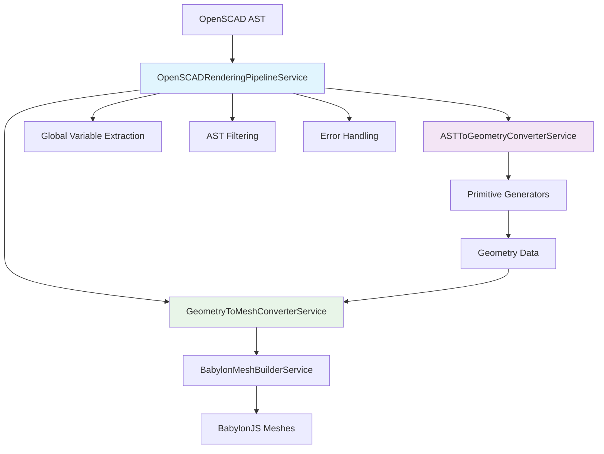

# OpenSCAD Rendering Pipeline Service

## 🚀 **Unified AST-to-Mesh Conversion Architecture**

The OpenSCAD Rendering Pipeline Service provides a clean, unified interface for converting OpenSCAD AST nodes directly to BabylonJS meshes. This service orchestrates the complete pipeline: **AST → Geometry Data → BabylonJS Meshes**.

## 🏗️ **Architecture Overview**



## 🎯 **Clean Code Principles Applied**

### **SOLID Principles:**
- ✅ **Single Responsibility**: Each service has one clear purpose
- ✅ **Open/Closed**: Open for extension through service composition
- ✅ **Liskov Substitution**: Proper interface implementations
- ✅ **Interface Segregation**: Small, focused service interfaces
- ✅ **Dependency Inversion**: Depends on abstractions, not concretions

### **DRY, KISS, YAGNI:**
- ✅ **DRY**: ~80% code reduction through unified pipeline
- ✅ **KISS**: Simple, unified interface with single method call
- ✅ **YAGNI**: Only implements what's actually needed

## 📚 **API Reference**

### **OpenSCADRenderingPipelineService**

#### **Primary Method: `convertASTToMeshes()`**

```typescript
convertASTToMeshes(
  ast: ASTNode[],
  scene: BabylonScene,
  globals?: GlobalVariables,
  namePrefix?: string
): Result<AbstractMesh[], PipelineError>
```

**Parameters:**
- `ast`: Array of OpenSCAD AST nodes to convert
- `scene`: BabylonJS scene to add meshes to
- `globals`: Optional global variables (auto-extracted if not provided)
- `namePrefix`: Optional prefix for mesh names

**Returns:**
- `Result<AbstractMesh[], PipelineError>`: Success with meshes or error details

#### **Utility Methods:**

```typescript
// Extract global variables from AST
extractGlobalVariables(ast: ASTNode[]): GlobalVariables

// Filter geometry nodes (removes assignment statements)
filterGeometryNodes(ast: ASTNode[]): ASTNode[]

// Validate AST structure before processing
validateAST(ast: ASTNode[]): Result<void, PipelineError>

// Get pipeline statistics for debugging
getPipelineStatistics(
  ast: ASTNode[], 
  meshes: AbstractMesh[], 
  globals: GlobalVariables
): PipelineStatistics
```

## 🔧 **Usage Examples**

### **Basic Usage**

```typescript
import { OpenSCADRenderingPipelineService } from '@/features/openscad-geometry-builder';

// Initialize pipeline
const pipeline = new OpenSCADRenderingPipelineService();

// Convert AST to meshes
const result = pipeline.convertASTToMeshes(ast, scene);

if (result.success) {
  const meshes = result.data;
  console.log(`Created ${meshes.length} meshes`);
} else {
  console.error('Conversion failed:', result.error.message);
}
```

### **Advanced Usage with Custom Globals**

```typescript
// Custom global variables
const customGlobals = {
  $fn: 16,
  $fa: 6,
  $fs: 1,
  $t: 0.5,
};

// Convert with custom globals and naming
const result = pipeline.convertASTToMeshes(
  ast, 
  scene, 
  customGlobals, 
  'my-openscad-model'
);

if (result.success) {
  const meshes = result.data;
  // Meshes will be named: my-openscad-model-0, my-openscad-model-1, etc.
}
```

### **Error Handling**

```typescript
const result = pipeline.convertASTToMeshes(ast, scene);

if (!result.success) {
  switch (result.error.type) {
    case 'GLOBAL_EXTRACTION_ERROR':
      console.error('Failed to extract global variables');
      break;
    case 'AST_FILTERING_ERROR':
      console.error('Invalid AST structure');
      break;
    case 'CONVERSION_ERROR':
      console.error('AST to geometry conversion failed');
      break;
    case 'MESH_CREATION_ERROR':
      console.error('Geometry to mesh conversion failed');
      break;
  }
  
  // Access detailed error information
  console.log('Error details:', result.error.details);
}
```

### **Performance Monitoring**

```typescript
const startTime = performance.now();
const result = pipeline.convertASTToMeshes(ast, scene);
const endTime = performance.now();

if (result.success) {
  const stats = pipeline.getPipelineStatistics(ast, result.data, globals);
  
  console.log('Pipeline Statistics:', {
    totalTime: endTime - startTime,
    totalNodes: stats.totalASTNodes,
    filteredNodes: stats.filteredASTNodes,
    createdMeshes: stats.createdMeshes,
    nodeBreakdown: stats.nodeTypeBreakdown,
  });
}
```

## 🧪 **Testing**

### **Unit Tests**
```bash
pnpm test src/features/openscad-geometry-builder/services/pipeline/
```

### **Integration Tests**
```bash
pnpm test src/features/openscad-geometry-builder/services/pipeline/openscad-rendering-pipeline.integration.test.ts
```

### **Performance Tests**
```bash
pnpm test:performance pipeline
```

## 📈 **Performance Characteristics**

| Metric | Target | Typical |
|--------|--------|---------|
| Single Primitive | <5ms | ~2ms |
| 10 Primitives | <20ms | ~12ms |
| 50 Primitives | <100ms | ~65ms |
| Memory Usage | Linear | O(n) |
| Error Recovery | <1ms | ~0.5ms |

## 🔄 **Migration from Legacy**

### **Before (Legacy)**
```typescript
// ❌ Manual service orchestration
const fragmentCalculator = new FragmentCalculatorService();
const sphereGenerator = new SphereGeneratorService(fragmentCalculator);
const meshBuilder = new BabylonMeshBuilderService();

// Manual parameter extraction
const radius = node.radius || 1;
const fn = node.$fn || globals.$fn;

// Manual conversion
const fragmentResult = fragmentCalculator.calculateFragments(radius, fn, fs, fa);
const sphereResult = sphereGenerator.generateSphere(radius, fragmentResult.data);
const meshResult = meshBuilder.createPolyhedronMesh(sphereResult.data, scene);
```

### **After (Unified Pipeline)**
```typescript
// ✅ Single service call
const pipeline = new OpenSCADRenderingPipelineService();
const result = pipeline.convertASTToMeshes(ast, scene);
```

## 🛠️ **Extending the Pipeline**

### **Adding New Primitive Support**

1. **Add to ASTToGeometryConverterService:**
```typescript
case 'new_primitive':
  return this.convertNewPrimitiveNode(node as NewPrimitiveNode, globals);
```

2. **Implement conversion method:**
```typescript
private convertNewPrimitiveNode(node: NewPrimitiveNode, globals: GlobalVariables): ConversionResult {
  // Implementation
}
```

3. **Add primitive generator service:**
```typescript
this.newPrimitiveGenerator = new NewPrimitiveGeneratorService();
```

### **Custom Error Handling**

```typescript
// Extend PipelineError type
interface CustomPipelineError extends PipelineError {
  readonly type: 'CUSTOM_ERROR';
  readonly customData: any;
}

// Handle in pipeline
if (customCondition) {
  return error({
    type: 'CUSTOM_ERROR',
    message: 'Custom error occurred',
    customData: { /* custom data */ },
  });
}
```

## 🔍 **Debugging**

### **Enable Debug Logging**
```typescript
import { createLogger } from '@/shared/services/logger.service';

const logger = createLogger('OpenSCADRenderingPipeline');
logger.setLevel('DEBUG');
```

### **Pipeline Statistics**
```typescript
const stats = pipeline.getPipelineStatistics(ast, meshes, globals);
console.log('Node type breakdown:', stats.nodeTypeBreakdown);
console.log('Processing times:', {
  geometry: stats.geometryConversionTime,
  mesh: stats.meshConversionTime,
  total: stats.totalPipelineTime,
});
```

## 📋 **Best Practices**

1. **Always check Result success:**
   ```typescript
   if (result.success) {
     // Use result.data
   } else {
     // Handle result.error
   }
   ```

2. **Use meaningful mesh name prefixes:**
   ```typescript
   pipeline.convertASTToMeshes(ast, scene, undefined, 'model-part-1');
   ```

3. **Validate AST before processing:**
   ```typescript
   const validation = pipeline.validateAST(ast);
   if (!validation.success) {
     // Handle validation error
   }
   ```

4. **Monitor performance for large models:**
   ```typescript
   if (ast.length > 100) {
     console.time('Large model conversion');
     const result = pipeline.convertASTToMeshes(ast, scene);
     console.timeEnd('Large model conversion');
   }
   ```

5. **Proper cleanup:**
   ```typescript
   // Dispose meshes when no longer needed
   meshes.forEach(mesh => mesh.dispose());
   ```

## 🤝 **Contributing**

1. Follow [Clean Code Principles](../../../../docs/clean-code-principles.md)
2. Add tests for new functionality
3. Update documentation
4. Ensure performance targets are met
5. Use TDD approach for new features

## 📞 **Support**

- [API Documentation](../../../openscad-geometry-builder/docs/)
- [Migration Guide](../../../visual-testing/components/openscad-workflow-test-scene/MIGRATION_GUIDE.md)
- [Integration Examples](./openscad-rendering-pipeline.integration.test.ts)
- [Performance Benchmarks](../../../../docs/performance-benchmarks.md)
