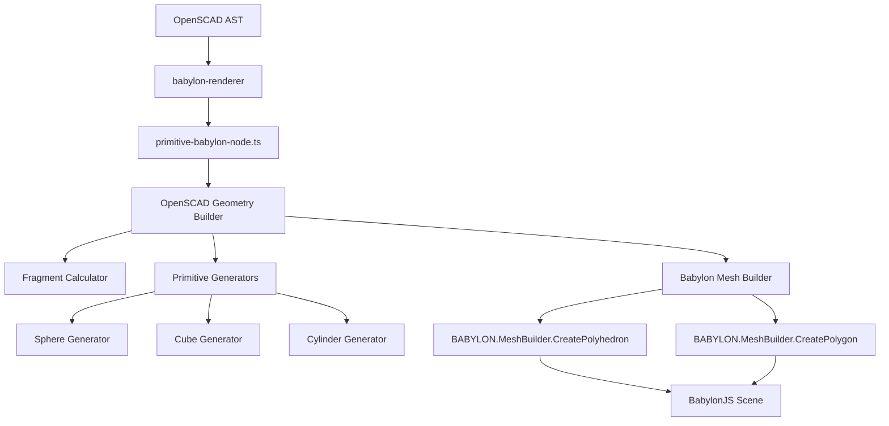

/**
 * @file openscad-geometry-builder.md
 * @description Comprehensive plan for implementing OpenSCAD-compatible geometry generation
 * that replicates desktop OpenSCAD's exact primitive tessellation algorithms.
 * 
 * @example
 * // Problem: $fn=3; sphere(5); renders incorrectly with BabylonJS built-in sphere
 * // Solution: Implement OpenSCAD's exact sphere tessellation algorithm
 * 
 * @author OpenSCAD Babylon Team
 * @version 1.0.0
 * @since 2025-07-29
 */

# OpenSCAD Geometry Builder Implementation Plan

## Problem Analysis

### Current Issue
The `$fn=3; sphere(5);` command renders incorrectly because:
- **BabylonJS built-in sphere** uses UV-sphere tessellation (longitude/latitude grid)
- **OpenSCAD desktop sphere** uses ring-based tessellation with specific phi angle calculations
- **Result**: Different mesh topology and vertex positioning for low-poly spheres

### Root Cause
BabylonJS primitives (CreateSphere, CreateBox, CreateCylinder) don't match OpenSCAD's tessellation algorithms, causing visual inconsistencies when comparing with desktop OpenSCAD output.

## OpenSCAD Algorithm Analysis

### Sphere Generation Algorithm (from primitives.cc)
```cpp
// Fragment calculation
int fragments = get_fragments_from_r(r, fn, fs, fa);
if (fn > 0) fragments = max(fn, 3);

// Ring calculation  
size_t num_rings = (fragments + 1) / 2;

// For each ring
for (int i = 0; i < num_rings; ++i) {
    double phi = (180.0 * (i + 0.5)) / num_rings;
    double radius = r * sin_degrees(phi);
    double z = r * cos_degrees(phi);
    generate_circle(vertices, radius, z, fragments);
}
```

### Key Differences from Standard UV-Sphere
1. **Ring-based approach**: Creates horizontal rings at specific phi angles
2. **Fragment-driven**: Uses $fn, $fs, $fa for tessellation control
3. **Specific phi calculation**: `phi = (180.0 * (i + 0.5)) / num_rings`
4. **Triangle winding**: Specific face generation pattern

## Architecture Design

### New Feature: `openscad-geometry-builder`

```
src/features/openscad-geometry-builder/
├── index.ts
├── services/
│   ├── fragment-calculator/
│   │   ├── fragment-calculator.ts
│   │   └── fragment-calculator.test.ts
│   ├── primitive-generators/
│   │   ├── 3d-primitives/
│   │   │   ├── sphere-generator/
│   │   │   │   ├── sphere-generator.ts
│   │   │   │   └── sphere-generator.test.ts
│   │   │   ├── cube-generator/
│   │   │   │   ├── cube-generator.ts
│   │   │   │   └── cube-generator.test.ts
│   │   │   ├── cylinder-generator/
│   │   │   │   ├── cylinder-generator.ts
│   │   │   │   └── cylinder-generator.test.ts
│   │   │   ├── polyhedron-generator/
│   │   │   │   ├── polyhedron-generator.ts
│   │   │   │   └── polyhedron-generator.test.ts
│   │   │   └── index.ts
│   │   ├── 2d-primitives/
│   │   │   ├── circle-generator/
│   │   │   │   ├── circle-generator.ts
│   │   │   │   └── circle-generator.test.ts
│   │   │   ├── square-generator/
│   │   │   │   ├── square-generator.ts
│   │   │   │   └── square-generator.test.ts
│   │   │   ├── polygon-generator/
│   │   │   │   ├── polygon-generator.ts
│   │   │   │   └── polygon-generator.test.ts
│   │   │   └── index.ts
│   │   ├── text-primitives/
│   │   │   ├── text-generator/
│   │   │   │   ├── text-generator.ts
│   │   │   │   └── text-generator.test.ts
│   │   │   ├── font-loader/
│   │   │   │   ├── font-loader.ts
│   │   │   │   └── font-loader.test.ts
│   │   │   └── index.ts
│   │   ├── import-primitives/
│   │   │   ├── stl-importer/
│   │   │   │   ├── stl-importer.ts
│   │   │   │   └── stl-importer.test.ts
│   │   │   ├── off-importer/
│   │   │   │   ├── off-importer.ts
│   │   │   │   └── off-importer.test.ts
│   │   │   └── index.ts
│   │   ├── geometric-functions/
│   │   │   ├── hull-generator/
│   │   │   │   ├── hull-generator.ts
│   │   │   │   └── hull-generator.test.ts
│   │   │   ├── minkowski-generator/
│   │   │   │   ├── minkowski-generator.ts
│   │   │   │   └── minkowski-generator.test.ts
│   │   │   ├── offset-generator/
│   │   │   │   ├── offset-generator.ts
│   │   │   │   └── offset-generator.test.ts
│   │   │   └── index.ts
│   │   └── index.ts
│   ├── geometry-bridge/
│   │   ├── babylon-mesh-builder/
│   │   │   ├── babylon-mesh-builder.ts
│   │   │   └── babylon-mesh-builder.test.ts
│   │   ├── polygon-bridge/
│   │   │   ├── polygon-bridge.ts
│   │   │   └── polygon-bridge.test.ts
│   │   └── index.ts
│   └── index.ts
├── types/
│   ├── geometry-data.ts
│   ├── primitive-parameters.ts
│   ├── 2d-geometry-data.ts
│   ├── text-parameters.ts
│   ├── import-parameters.ts
│   └── index.ts
└── utils/
    ├── math-helpers/
    │   ├── trigonometry.ts
    │   ├── vector-operations.ts
    │   ├── matrix-operations.ts
    │   └── trigonometry.test.ts
    ├── validation/
    │   ├── geometry-validator.ts
    │   └── geometry-validator.test.ts
    └── index.ts
```

### Integration with Existing Architecture



## Comprehensive Primitive Analysis

### 3D Primitives Analysis

#### Cube Algorithm (from primitives.cc)
```cpp
// Simple box generation with center parameter
double x1, x2, y1, y2, z1, z2;
if (this->center) {
    x1 = -this->x / 2; x2 = +this->x / 2;
    y1 = -this->y / 2; y2 = +this->y / 2;
    z1 = -this->z / 2; z2 = +this->z / 2;
} else {
    x1 = 0; x2 = this->x;
    y1 = 0; y2 = this->y;
    z1 = 0; z2 = this->z;
}
// Creates 8 vertices, 6 faces (quads)
```
**Complexity**: Low | **Priority**: High | **BabylonJS Integration**: CreatePolyhedron

#### Cylinder Algorithm (from primitives.cc)
```cpp
auto num_fragments = Calc::get_fragments_from_r(max(r1, r2), fn, fs, fa);
// Generate bottom circle at z1 with radius r1
generate_circle(vertices, r1, z1, num_fragments);
// Generate top circle at z2 with radius r2
generate_circle(vertices, r2, z2, num_fragments);
// Connect with side faces, add top/bottom caps
```
**Complexity**: Medium | **Priority**: High | **BabylonJS Integration**: CreatePolyhedron

#### Polyhedron Algorithm (from primitives.cc)
```cpp
// Direct vertex/face specification - no tessellation
// Validates face indices, handles convexity parameter
// Simply passes through user-defined geometry
```
**Complexity**: Low | **Priority**: Medium | **BabylonJS Integration**: CreatePolyhedron (direct)

### 2D Primitives Analysis

#### Circle Algorithm (from primitives.cc)
```cpp
auto fragments = Calc::get_fragments_from_r(r, fn, fs, fa);
for (int i = 0; i < fragments; ++i) {
    double phi = (360.0 * i) / fragments;
    vertices[i] = {r * cos_degrees(phi), r * sin_degrees(phi)};
}
// Creates Polygon2d with single outline
```
**Complexity**: Low | **Priority**: High | **BabylonJS Integration**: CreatePolygon

#### Square Algorithm (from primitives.cc)
```cpp
Vector2d v1(0, 0), v2(x, y);
if (center) {
    v1 -= Vector2d(x/2, y/2);
    v2 -= Vector2d(x/2, y/2);
}
// Creates 4-vertex rectangle
```
**Complexity**: Low | **Priority**: High | **BabylonJS Integration**: CreatePolygon

#### Polygon Algorithm (from primitives.cc)
```cpp
// Supports points array and optional paths for holes
// Multiple outlines: first positive, subsequent negative (holes)
for (const auto& path : paths) {
    Outline2d outline;
    for (const auto& index : path) {
        outline.vertices.push_back(points[index]);
    }
}
```
**Complexity**: Medium | **Priority**: Medium | **BabylonJS Integration**: CreatePolygon with holes

### Text and Advanced Shapes Analysis

#### Text Algorithm (from TextNode.cc)
```cpp
// Uses FreetypeRenderer for font rasterization
// Converts text to 2D polygon outlines
// Supports font, size, halign, valign parameters
// Complex glyph tessellation and kerning
```
**Complexity**: High | **Priority**: Low | **BabylonJS Integration**: CreatePolygon + Font loading

#### Import Algorithm (from ImportNode.cc)
```cpp
// File format detection (STL, OFF, AMF, 3MF)
// Mesh loading and validation
// Coordinate system conversion
// Error handling for malformed files
```
**Complexity**: High | **Priority**: Low | **BabylonJS Integration**: Custom mesh loader

### Geometric Functions Analysis

#### Hull Algorithm (from CgalAdvNode.cc)
```cpp
// Convex hull computation using CGAL
// Operates on child geometry union
// No parameters except implicit children
// Complex 3D computational geometry
```
**Complexity**: Very High | **Priority**: Low | **BabylonJS Integration**: Custom algorithm or library

#### Minkowski Algorithm (from CgalAdvNode.cc)
```cpp
// Minkowski sum using CGAL
// Convexity parameter for optimization
// Operates on two child geometries
// Computationally intensive operation
```
**Complexity**: Very High | **Priority**: Low | **BabylonJS Integration**: Custom algorithm or library

#### Offset Algorithm (from OffsetNode.cc)
```cpp
// 2D offset using Clipper2 library
// Supports r (radius) and delta parameters
// Chamfer option for corner handling
// Uses $fn, $fs, $fa for arc tessellation
```
**Complexity**: High | **Priority**: Medium | **BabylonJS Integration**: Clipper2 port or custom

## Implementation Plan

### Phase 1: Core Infrastructure (Week 1)
1. **Create feature structure** following SRP principles
2. **Implement Fragment Calculator** replicating `get_fragments_from_r`
3. **Create base types** for geometry data and parameters
4. **Setup testing framework** with real BabylonJS NullEngine
5. **Implement math utilities** (trigonometry, vector operations)

### Phase 2: Essential 3D Primitives (Week 1-2)
1. **Sphere Generator** - Ring-based tessellation (HIGH PRIORITY)
2. **Cube Generator** - Simple box with center parameter (HIGH PRIORITY)
3. **Cylinder Generator** - Circles + side faces + caps (HIGH PRIORITY)
4. **Test with $fn=3 cases** for all primitives

### Phase 3: Essential 2D Primitives (Week 2)
1. **Circle Generator** - Fragment-based tessellation (HIGH PRIORITY)
2. **Square Generator** - 4-vertex rectangle (HIGH PRIORITY)
3. **Polygon Generator** - Points/paths with holes (MEDIUM PRIORITY)
4. **2D to 3D bridging** - Z=0 positioning

### Phase 4: Polyhedron Support (Week 2-3)
1. **Direct vertex/face specification** (MEDIUM PRIORITY)
2. **Face validation and winding order**
3. **Convexity parameter handling**
4. **Integration with existing CSG pipeline**

### Phase 5: Integration & Replacement (Week 3)
1. **Replace BabylonJS built-in primitives**
2. **Update primitive-babylon-node.ts**
3. **Ensure backward compatibility**
4. **Performance optimization and caching**

### Phase 6: Advanced 2D Operations (Week 4)
1. **Offset operations** using Clipper2 concepts (MEDIUM PRIORITY)
2. **2D boolean operations** preparation
3. **Advanced polygon handling**

### Phase 7: Text Support (Week 5-6)
1. **Font loading infrastructure** (LOW PRIORITY)
2. **Text to polygon conversion**
3. **Glyph tessellation and kerning**
4. **Font parameter handling**

### Phase 8: Import Functionality (Week 6-7)
1. **STL file parsing** (LOW PRIORITY)
2. **OFF file parsing**
3. **Mesh validation and conversion**
4. **Error handling for malformed files**

### Phase 9: Advanced Geometric Functions (Week 8-10)
1. **Hull operations** - Convex hull algorithms (VERY LOW PRIORITY)
2. **Minkowski operations** - Complex geometric computation (VERY LOW PRIORITY)
3. **Advanced CSG preparation**

## Technical Implementation Details

### Core Service Interfaces

#### Fragment Calculator Service
```typescript
interface FragmentCalculatorService {
  calculateFragments(
    radius: number,
    fn: number,
    fs: number,
    fa: number
  ): Result<number, FragmentCalculationError>;

  validateFragmentParameters(
    fn: number,
    fs: number,
    fa: number
  ): Result<void, ValidationError>;
}
```

#### 3D Primitive Generators

##### Sphere Generator Service
```typescript
interface SphereGeometryData {
  readonly vertices: readonly Vector3[];
  readonly faces: readonly number[][];
  readonly normals: readonly Vector3[];
  readonly uvs?: readonly Vector2[];
}

interface SphereGeneratorService {
  generateSphere(
    radius: number,
    fragments: number
  ): Result<SphereGeometryData, SphereGenerationError>;

  generateSphereWithDiameter(
    diameter: number,
    fragments: number
  ): Result<SphereGeometryData, SphereGenerationError>;
}
```

##### Cube Generator Service
```typescript
interface CubeGeometryData {
  readonly vertices: readonly Vector3[];
  readonly faces: readonly number[][];
  readonly normals: readonly Vector3[];
}

interface CubeGeneratorService {
  generateCube(
    size: Vector3 | number,
    center: boolean
  ): Result<CubeGeometryData, CubeGenerationError>;
}
```

##### Cylinder Generator Service
```typescript
interface CylinderGeometryData {
  readonly vertices: readonly Vector3[];
  readonly faces: readonly number[][];
  readonly normals: readonly Vector3[];
}

interface CylinderGeneratorService {
  generateCylinder(
    height: number,
    r1: number,
    r2: number,
    center: boolean,
    fragments: number
  ): Result<CylinderGeometryData, CylinderGenerationError>;

  generateCylinderWithDiameters(
    height: number,
    d1: number,
    d2: number,
    center: boolean,
    fragments: number
  ): Result<CylinderGeometryData, CylinderGenerationError>;
}
```

##### Polyhedron Generator Service
```typescript
interface PolyhedronGeneratorService {
  generatePolyhedron(
    points: readonly Vector3[],
    faces: readonly number[][],
    convexity: number
  ): Result<CubeGeometryData, PolyhedronGenerationError>;

  validatePolyhedronData(
    points: readonly Vector3[],
    faces: readonly number[][]
  ): Result<void, ValidationError>;
}
```

#### 2D Primitive Generators

##### Circle Generator Service
```typescript
interface Circle2DGeometryData {
  readonly vertices: readonly Vector2[];
  readonly outline: readonly number[];
}

interface CircleGeneratorService {
  generateCircle(
    radius: number,
    fragments: number
  ): Result<Circle2DGeometryData, CircleGenerationError>;

  generateCircleWithDiameter(
    diameter: number,
    fragments: number
  ): Result<Circle2DGeometryData, CircleGenerationError>;
}
```

##### Square Generator Service
```typescript
interface Square2DGeometryData {
  readonly vertices: readonly Vector2[];
  readonly outline: readonly number[];
}

interface SquareGeneratorService {
  generateSquare(
    size: Vector2 | number,
    center: boolean
  ): Result<Square2DGeometryData, SquareGenerationError>;
}
```

##### Polygon Generator Service
```typescript
interface Polygon2DGeometryData {
  readonly vertices: readonly Vector2[];
  readonly outlines: readonly (readonly number[])[];
  readonly holes: readonly (readonly number[])[];
}

interface PolygonGeneratorService {
  generatePolygon(
    points: readonly Vector2[],
    paths?: readonly (readonly number[])[]
  ): Result<Polygon2DGeometryData, PolygonGenerationError>;

  validatePolygonData(
    points: readonly Vector2[],
    paths?: readonly (readonly number[])[]
  ): Result<void, ValidationError>;
}
```

#### Text and Import Services

##### Text Generator Service
```typescript
interface TextGeometryData {
  readonly vertices: readonly Vector2[];
  readonly outlines: readonly (readonly number[])[];
  readonly glyphBounds: readonly BoundingBox2D[];
}

interface TextGeneratorService {
  generateText(
    text: string,
    size: number,
    font: string,
    halign: 'left' | 'center' | 'right',
    valign: 'top' | 'center' | 'baseline' | 'bottom'
  ): Result<TextGeometryData, TextGenerationError>;

  loadFont(fontPath: string): Result<FontData, FontLoadError>;
}
```

##### Import Services
```typescript
interface ImportedGeometryData {
  readonly vertices: readonly Vector3[];
  readonly faces: readonly number[][];
  readonly normals?: readonly Vector3[];
}

interface STLImporterService {
  importSTL(fileData: ArrayBuffer): Result<ImportedGeometryData, ImportError>;
}

interface OFFImporterService {
  importOFF(fileData: string): Result<ImportedGeometryData, ImportError>;
}
```

#### Geometric Function Services

##### Hull Generator Service
```typescript
interface HullGeneratorService {
  generateHull(
    geometries: readonly ImportedGeometryData[]
  ): Result<ImportedGeometryData, HullGenerationError>;
}
```

##### Minkowski Generator Service
```typescript
interface MinkowskiGeneratorService {
  generateMinkowski(
    geometry1: ImportedGeometryData,
    geometry2: ImportedGeometryData,
    convexity: number
  ): Result<ImportedGeometryData, MinkowskiGenerationError>;
}
```

##### Offset Generator Service
```typescript
interface OffsetGeneratorService {
  generateOffset(
    geometry: Polygon2DGeometryData,
    radius?: number,
    delta?: number,
    chamfer: boolean,
    fragments: number
  ): Result<Polygon2DGeometryData, OffsetGenerationError>;
}
```

#### Babylon Bridge Services

##### Babylon Mesh Builder Service
```typescript
interface BabylonMeshBuilderService {
  createPolyhedronMesh(
    geometryData: SphereGeometryData | CubeGeometryData | CylinderGeometryData,
    scene: BABYLON.Scene,
    name?: string
  ): Result<BABYLON.Mesh, MeshCreationError>;

  createPolygonMesh(
    geometryData: Circle2DGeometryData | Square2DGeometryData | Polygon2DGeometryData,
    scene: BABYLON.Scene,
    name?: string
  ): Result<BABYLON.Mesh, MeshCreationError>;
}
```

##### Polygon Bridge Service
```typescript
interface PolygonBridgeService {
  convertTo3D(
    geometry2D: Circle2DGeometryData | Square2DGeometryData | Polygon2DGeometryData,
    z: number
  ): Result<ImportedGeometryData, ConversionError>;

  triangulate(
    geometry2D: Polygon2DGeometryData
  ): Result<readonly number[][], TriangulationError>;
}
```

## Testing Strategy

### Comprehensive Testing Approach

#### Unit Testing by Category

##### Fragment Calculator Tests
```typescript
describe('FragmentCalculatorService', () => {
  test('$fn=3 returns exactly 3 fragments', () => {
    expect(calculator.calculateFragments(5, 3, 2, 12)).toEqual(Ok(3));
  });

  test('$fs/$fa calculations match OpenSCAD formulas', () => {
    // Test: ceil(max(min(360.0 / fa, r * 2 * PI / fs), 5))
    expect(calculator.calculateFragments(10, 0, 2, 12)).toEqual(Ok(31));
  });

  test('property-based testing with fast-check', () => {
    fc.assert(fc.property(
      fc.float(0.1, 100), fc.float(0, 100), fc.float(0.1, 10), fc.float(1, 90),
      (r, fn, fs, fa) => {
        const result = calculator.calculateFragments(r, fn, fs, fa);
        return result.isOk() && result.value >= 3;
      }
    ));
  });
});
```

##### 3D Primitive Generator Tests
```typescript
describe('SphereGeneratorService', () => {
  test('$fn=3 sphere matches OpenSCAD vertex positions', () => {
    const result = generator.generateSphere(5, 3);
    expect(result.isOk()).toBe(true);

    const geometry = result.value;
    // Verify exact vertex positions for 2 rings
    expect(geometry.vertices).toHaveLength(6); // 3 fragments * 2 rings

    // Ring 0: phi = 45°, radius = 5 * sin(45°) = 3.536
    expect(geometry.vertices[0]).toBeCloseTo({x: 3.536, y: 0, z: 3.536});
    // Ring 1: phi = 135°, radius = 5 * sin(135°) = 3.536
    expect(geometry.vertices[3]).toBeCloseTo({x: 3.536, y: 0, z: -3.536});
  });

  test('face connectivity follows OpenSCAD pattern', () => {
    const result = generator.generateSphere(5, 4);
    const geometry = result.value;

    // Verify triangular faces connect rings correctly
    expect(geometry.faces[0]).toEqual([0, 1, 5, 4]); // Quad face
  });
});

describe('CubeGeneratorService', () => {
  test('centered cube has correct vertex positions', () => {
    const result = generator.generateCube(10, true);
    const geometry = result.value;

    expect(geometry.vertices).toHaveLength(8);
    expect(geometry.vertices[0]).toEqual({x: -5, y: -5, z: -5});
    expect(geometry.vertices[7]).toEqual({x: 5, y: 5, z: 5});
  });

  test('non-centered cube starts at origin', () => {
    const result = generator.generateCube(10, false);
    const geometry = result.value;

    expect(geometry.vertices[0]).toEqual({x: 0, y: 0, z: 0});
    expect(geometry.vertices[7]).toEqual({x: 10, y: 10, z: 10});
  });
});

describe('CylinderGeneratorService', () => {
  test('cone generation (r2=0) creates apex vertex', () => {
    const result = generator.generateCylinder(10, 5, 0, false, 8);
    const geometry = result.value;

    // Should have bottom circle + apex point
    expect(geometry.vertices).toHaveLength(9); // 8 + 1 apex
    expect(geometry.vertices[8]).toEqual({x: 0, y: 0, z: 10}); // Apex
  });
});
```

##### 2D Primitive Generator Tests
```typescript
describe('CircleGeneratorService', () => {
  test('$fn=3 circle creates triangle', () => {
    const result = generator.generateCircle(5, 3);
    const geometry = result.value;

    expect(geometry.vertices).toHaveLength(3);
    // Verify 120° spacing
    expect(geometry.vertices[0]).toBeCloseTo({x: 5, y: 0});
    expect(geometry.vertices[1]).toBeCloseTo({x: -2.5, y: 4.33});
    expect(geometry.vertices[2]).toBeCloseTo({x: -2.5, y: -4.33});
  });
});

describe('PolygonGeneratorService', () => {
  test('polygon with holes creates multiple outlines', () => {
    const points = [
      {x: 0, y: 0}, {x: 10, y: 0}, {x: 10, y: 10}, {x: 0, y: 10}, // Outer
      {x: 2, y: 2}, {x: 8, y: 2}, {x: 8, y: 8}, {x: 2, y: 8}     // Inner hole
    ];
    const paths = [[0, 1, 2, 3], [4, 5, 6, 7]];

    const result = generator.generatePolygon(points, paths);
    const geometry = result.value;

    expect(geometry.outlines).toHaveLength(1);
    expect(geometry.holes).toHaveLength(1);
  });
});
```

##### Text and Import Tests
```typescript
describe('TextGeneratorService', () => {
  test('text generation creates valid polygon outlines', () => {
    const result = generator.generateText('A', 12, 'Arial', 'center', 'baseline');
    expect(result.isOk()).toBe(true);

    const geometry = result.value;
    expect(geometry.outlines.length).toBeGreaterThan(0);
    expect(geometry.vertices.length).toBeGreaterThan(0);
  });
});

describe('STLImporterService', () => {
  test('binary STL import creates valid geometry', () => {
    const stlData = createTestSTLData(); // Binary STL test data
    const result = importer.importSTL(stlData);

    expect(result.isOk()).toBe(true);
    const geometry = result.value;
    expect(geometry.vertices.length).toBeGreaterThan(0);
    expect(geometry.faces.length).toBeGreaterThan(0);
  });
});
```

##### Geometric Function Tests
```typescript
describe('HullGeneratorService', () => {
  test('convex hull of two cubes creates valid geometry', () => {
    const cube1 = createTestCube({x: 0, y: 0, z: 0});
    const cube2 = createTestCube({x: 5, y: 5, z: 5});

    const result = generator.generateHull([cube1, cube2]);
    expect(result.isOk()).toBe(true);

    const hull = result.value;
    expect(hull.vertices.length).toBeGreaterThanOrEqual(8);
  });
});

describe('OffsetGeneratorService', () => {
  test('positive offset expands polygon', () => {
    const square = createTestSquare(10);
    const result = generator.generateOffset(square, 2, undefined, false, 16);

    expect(result.isOk()).toBe(true);
    const offset = result.value;

    // Verify expanded dimensions
    const bounds = calculateBounds(offset.vertices);
    expect(bounds.width).toBeCloseTo(14); // 10 + 2*2
    expect(bounds.height).toBeCloseTo(14);
  });
});
```

#### Integration Testing Strategy

##### BabylonJS Integration Tests
```typescript
describe('BabylonMeshBuilderService', () => {
  let engine: BABYLON.NullEngine;
  let scene: BABYLON.Scene;

  beforeEach(() => {
    engine = new BABYLON.NullEngine();
    scene = new BABYLON.Scene(engine);
  });

  test('sphere geometry creates valid BabylonJS mesh', () => {
    const sphereData = createTestSphereData();
    const result = builder.createPolyhedronMesh(sphereData, scene);

    expect(result.isOk()).toBe(true);
    const mesh = result.value;
    expect(mesh.getTotalVertices()).toBeGreaterThan(0);
    expect(mesh.getTotalIndices()).toBeGreaterThan(0);
  });

  test('2D polygon creates flat mesh at Z=0', () => {
    const circleData = createTestCircleData();
    const result = builder.createPolygonMesh(circleData, scene);

    expect(result.isOk()).toBe(true);
    const mesh = result.value;

    // Verify all vertices have Z=0
    const positions = mesh.getVerticesData(BABYLON.VertexBuffer.PositionKind);
    for (let i = 2; i < positions.length; i += 3) {
      expect(positions[i]).toBeCloseTo(0); // Z coordinate
    }
  });
});
```

#### Visual Regression Testing
```typescript
describe('Visual Regression Tests', () => {
  test('$fn=3 sphere matches OpenSCAD reference image', async () => {
    const sphereData = sphereGenerator.generateSphere(5, 3).value;
    const mesh = meshBuilder.createPolyhedronMesh(sphereData, scene).value;

    const screenshot = await captureSceneScreenshot(scene);
    const reference = await loadReferenceImage('sphere-fn3.png');

    expect(compareImages(screenshot, reference)).toBeLessThan(0.01); // 1% tolerance
  });

  test('all primitives render correctly with various parameters', async () => {
    const testCases = [
      { primitive: 'sphere', params: { r: 5, fn: 6 } },
      { primitive: 'cube', params: { size: [2, 4, 6], center: true } },
      { primitive: 'cylinder', params: { h: 10, r1: 3, r2: 5, fn: 8 } }
    ];

    for (const testCase of testCases) {
      const mesh = await renderPrimitive(testCase.primitive, testCase.params);
      const screenshot = await captureSceneScreenshot(scene);
      const reference = await loadReferenceImage(`${testCase.primitive}-reference.png`);

      expect(compareImages(screenshot, reference)).toBeLessThan(0.02);
    }
  });
});
```

### Test Data Sources and Validation

#### OpenSCAD Desktop Reference Generation
```bash
# Generate reference meshes for comparison
openscad -o sphere-fn3.stl -D '$fn=3; sphere(5);'
openscad -o cube-centered.stl -D 'cube([2,4,6], center=true);'
openscad -o cylinder-cone.stl -D '$fn=8; cylinder(h=10, r1=3, r2=0);'
```

#### Mathematical Verification
- **Trigonometric calculations**: Verify cos/sin degree functions match OpenSCAD
- **Fragment formulas**: Test edge cases for $fn, $fs, $fa calculations
- **Geometric properties**: Validate volumes, surface areas, bounding boxes

#### Performance Benchmarking
```typescript
describe('Performance Tests', () => {
  test('sphere generation meets <5ms target', () => {
    const start = performance.now();
    const result = generator.generateSphere(10, 32);
    const duration = performance.now() - start;

    expect(result.isOk()).toBe(true);
    expect(duration).toBeLessThan(5);
  });

  test('complex polygon with holes processes efficiently', () => {
    const complexPolygon = createComplexPolygonWithHoles(1000); // 1000 vertices
    const start = performance.now();
    const result = generator.generatePolygon(complexPolygon.points, complexPolygon.paths);
    const duration = performance.now() - start;

    expect(result.isOk()).toBe(true);
    expect(duration).toBeLessThan(10);
  });
});
```

## Performance Requirements

### Optimization Targets
- **Generation Time**: <5ms for basic primitives
- **Memory Usage**: Minimal vertex/face data structures
- **BabylonJS Integration**: Zero-copy when possible
- **Caching**: Reuse geometry for identical parameters

### Memory Management
- Use `readonly` arrays for immutable geometry data
- Implement proper disposal patterns
- Avoid memory leaks in BabylonJS mesh creation

## Quality Standards

### Code Quality Requirements
- **Zero TypeScript Errors**: Strict mode compliance
- **Zero Biome Violations**: Automated code quality
- **95% Test Coverage**: Comprehensive testing
- **SRP Compliance**: Single responsibility per service
- **Functional Programming**: Pure functions, Result<T,E> patterns

### Documentation Requirements
- **JSDoc Comments**: All public APIs documented
- **Architecture Diagrams**: Mermaid diagrams for complex flows
- **Usage Examples**: Code examples for each service
- **Performance Notes**: Document optimization decisions

## Integration Points

### Existing Components to Modify
1. **primitive-babylon-node.ts**: Replace BabylonJS built-in calls
2. **sphere-babylon-node.ts**: Use new sphere generator
3. **cube-babylon-node.ts**: Use new cube generator
4. **cylinder-babylon-node.ts**: Use new cylinder generator

### Backward Compatibility
- Maintain existing API interfaces
- Ensure no breaking changes to AST processing
- Preserve performance characteristics
- Support all existing OpenSCAD parameters

## Implementation Priority Matrix

### Priority Classification

#### HIGH PRIORITY (Weeks 1-3)
**Essential for basic OpenSCAD compatibility**
- ✅ **Sphere Generator** - Fixes immediate $fn=3 issue
- ✅ **Cube Generator** - Most common primitive
- ✅ **Cylinder Generator** - Essential 3D primitive
- ✅ **Circle Generator** - Basic 2D primitive
- ✅ **Square Generator** - Basic 2D primitive
- ✅ **Fragment Calculator** - Core tessellation logic

#### MEDIUM PRIORITY (Weeks 4-6)
**Important for comprehensive OpenSCAD support**
- ⚠️ **Polygon Generator** - Complex 2D shapes with holes
- ⚠️ **Polyhedron Generator** - Custom mesh support
- ⚠️ **Offset Generator** - 2D operations
- ⚠️ **BabylonJS Integration** - Mesh bridging optimization

#### LOW PRIORITY (Weeks 7-10)
**Advanced features for complete compatibility**
- 🔄 **Text Generator** - Font rendering complexity
- 🔄 **STL/OFF Importers** - File format support
- 🔄 **Advanced 2D Operations** - Complex polygon processing

#### VERY LOW PRIORITY (Future phases)
**Complex computational geometry**
- ❌ **Hull Generator** - Requires advanced algorithms
- ❌ **Minkowski Generator** - Computationally intensive
- ❌ **Advanced Import Formats** - AMF, 3MF support

### Complexity Assessment

#### Low Complexity (1-2 days each)
- Fragment Calculator, Cube Generator, Square Generator
- Direct parameter mapping, simple vertex generation

#### Medium Complexity (3-5 days each)
- Sphere Generator, Cylinder Generator, Circle Generator, Polygon Generator
- Tessellation algorithms, face generation, parameter validation

#### High Complexity (1-2 weeks each)
- Text Generator, Import Services, Offset Generator
- External library integration, file parsing, complex algorithms

#### Very High Complexity (3+ weeks each)
- Hull Generator, Minkowski Generator
- Advanced computational geometry, performance optimization

## Success Criteria

### Functional Requirements by Priority

#### HIGH PRIORITY Success Criteria
- ✅ `$fn=3; sphere(5);` renders identically to OpenSCAD desktop
- ✅ `cube([2,4,6], center=true);` matches exact vertex positions
- ✅ `cylinder(h=10, r1=5, r2=0, $fn=8);` creates proper cone geometry
- ✅ `circle(r=5, $fn=6);` generates hexagonal 2D shape
- ✅ `square([3,7], center=false);` creates correct rectangle
- ✅ All fragment parameters ($fn, $fs, $fa) work correctly
- ✅ Center parameter behavior matches OpenSCAD exactly

#### MEDIUM PRIORITY Success Criteria
- ✅ Complex polygons with holes render correctly
- ✅ Polyhedron with custom vertices/faces works
- ✅ 2D offset operations produce expected results
- ✅ BabylonJS integration maintains <16ms render targets
- ✅ Memory usage remains within acceptable limits

#### LOW PRIORITY Success Criteria
- ✅ Text rendering produces valid 2D polygons
- ✅ STL/OFF import creates valid geometry
- ✅ Font loading and glyph tessellation works
- ✅ File format validation and error handling

#### VERY LOW PRIORITY Success Criteria
- ✅ Hull operations produce mathematically correct results
- ✅ Minkowski sums work for simple geometries
- ✅ Advanced import formats supported
- ✅ Performance optimization for complex operations

### Technical Requirements by Phase

#### Phase 1-3 (HIGH PRIORITY)
- ✅ Zero TypeScript compilation errors
- ✅ Zero Biome violations
- ✅ 95%+ test coverage for core primitives
- ✅ All essential integration tests pass
- ✅ Visual regression tests for basic primitives
- ✅ Performance: <5ms generation, <16ms total render

#### Phase 4-6 (MEDIUM PRIORITY)
- ✅ Comprehensive error handling with Result<T,E>
- ✅ Memory leak prevention and cleanup
- ✅ Advanced test scenarios and edge cases
- ✅ Documentation for all public APIs
- ✅ Performance optimization and caching

#### Phase 7+ (LOW/VERY LOW PRIORITY)
- ✅ Advanced algorithm implementation
- ✅ External library integration
- ✅ Complex computational geometry
- ✅ Optimization for large datasets

## Implementation Roadmap

### Week 1: Foundation
1. **Day 1-2**: Feature structure, Fragment Calculator, base types
2. **Day 3-4**: Sphere Generator with $fn=3 test case
3. **Day 5**: Cube Generator and initial BabylonJS integration

### Week 2: Core 3D Primitives
1. **Day 1-3**: Cylinder Generator with cone/truncated cone support
2. **Day 4-5**: Polyhedron Generator and validation

### Week 3: Core 2D Primitives
1. **Day 1-2**: Circle Generator with fragment tessellation
2. **Day 3-4**: Square Generator and 2D to 3D bridging
3. **Day 5**: Integration testing and optimization

### Week 4: Advanced 2D
1. **Day 1-3**: Polygon Generator with holes support
2. **Day 4-5**: Offset Generator foundation

### Week 5-6: Polish and Optimization
1. **Performance optimization and caching**
2. **Comprehensive testing and validation**
3. **Documentation and examples**

### Week 7+: Advanced Features (Optional)
1. **Text rendering infrastructure**
2. **Import functionality**
3. **Advanced geometric operations**

## Next Steps

### Immediate Actions (This Week)
1. **Create feature directory structure** following SRP principles
2. **Implement Fragment Calculator** with comprehensive tests
3. **Start Sphere Generator** focusing on $fn=3 case
4. **Setup BabylonJS integration** with NullEngine testing
5. **Establish visual regression testing** framework

### Short-term Goals (Next 2 Weeks)
1. **Complete all HIGH PRIORITY primitives**
2. **Achieve visual parity** with OpenSCAD desktop
3. **Establish performance benchmarks**
4. **Create comprehensive test suite**
5. **Document implementation patterns**

### Long-term Vision (1-3 Months)
1. **Complete MEDIUM PRIORITY features**
2. **Evaluate LOW PRIORITY implementations**
3. **Consider VERY LOW PRIORITY based on user needs**
4. **Optimize for production deployment**
5. **Maintain compatibility with OpenSCAD updates**

This comprehensive plan provides a complete roadmap for implementing OpenSCAD-compatible geometry generation with clear priorities, success criteria, and implementation phases while maintaining the project's strict quality standards and architectural principles.
